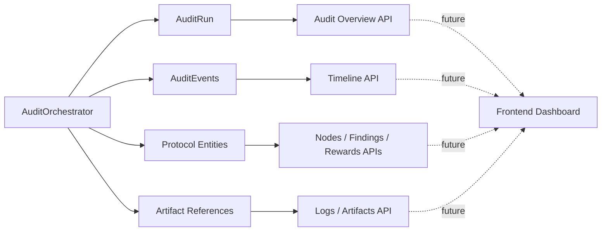
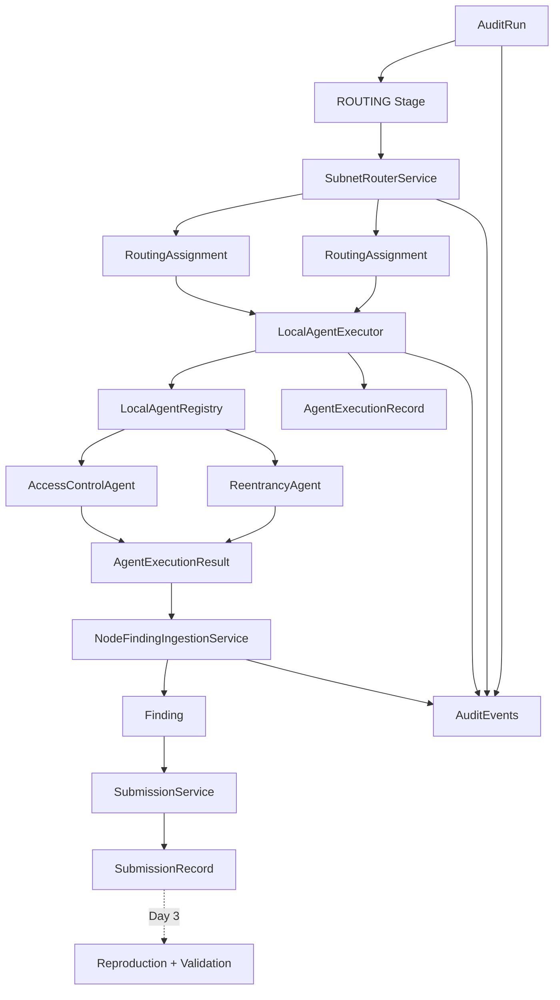

# ProofGuard Integration — Day 1

## AuditRun

`AuditRun` is the durable orchestration identity for one execution of a
ProofGuard audit. It belongs to one project and sits above existing protocol
identities. In particular, `routing_id` remains the identity of a concrete
`ProjectRoutingRecord`; it is an optional downstream reference on `AuditRun`
and is not replaced or overloaded.

The versioned `audit_run_v1` record contains:

- run and project identity;
- high-level lifecycle status and current stage;
- execution mode (`local_simulator` today);
- direct anchor references for routing, task budget, reward cycle and report;
- deterministic request fingerprint;
- normalized completed/total stage progress;
- UTC lifecycle timestamps and safe failure information;
- one state record for every stage;
- lightweight artifact references; and
- event count and latest sequence cursor.

It intentionally does not embed routings, findings, submissions, reproduction
output, calculations, RewardEvents or final reports. Detailed resources remain
owned by their existing domain services.

Run IDs are random `audit_run_<uuid-hex>` identifiers. Random identity permits
multiple intentional runs over the same inputs. Request idempotency is kept
separate through `request_fingerprint` so a later request-deduplication policy
can choose whether to reuse, reject or create a new run.

## Audit Lifecycle

The high-level statuses are:

```text
CREATED -> RUNNING -> COMPLETED
                   -> FAILED
```

`status` answers whether an audit is queued, active, successful or failed.
`current_stage` answers where active work is positioned. This separation keeps
dashboard filtering stable while the stage graph evolves.

`COMPLETED` is immutable under normal service semantics. A failed run records
its failed stage, safe code/message and UTC failure time. Day 1 deliberately
does not resume failed runs; stage states and attempt counts preserve enough
information for a later explicit recovery policy.

## Audit Stages

The ordered stages are:

```text
PREPARING
ROUTING
EXECUTING_AGENTS
REPRODUCING
VALIDATING
CALIBRATING
CLUSTERING
ASSESSING_QUALITY
REWARDING
REPORTING
COMPLETED
```

`COMPLETED` is a lifecycle sentinel, not a business-stage handler. The ten
executable stages determine normalized progress. Each `AuditStageState` stores
status (`PENDING`, `RUNNING`, `COMPLETED`, `FAILED`, `SKIPPED`), attempt count,
timestamps, structured progress, safe summary/error fields, artifact refs and
the stage's first/last event sequence.

The state machine centrally requires the exact linear order. A stage can start
only after every required predecessor is terminal-successful. Backward jumps,
forward skips, terminal restarts and completion with unfinished stages fail.
Repeating the current start or completion transition is idempotent.

## AuditOrchestrator

`AuditOrchestrator` coordinates state, events and delegation. It implements:

- start run / start stage;
- update structured stage progress;
- complete or fail a stage;
- complete or fail a run; and
- execute a registry of `AuditStageHandler` adapters.

Handlers implement `execute(AuditStageContext) -> StageResult`. `StageResult`
contains only a stage result, summary, progress, artifact refs, entity refs and
bounded JSON metadata. The orchestrator contains no routing algorithm, agent
analysis, Foundry invocation, validation policy, calibration formula, reward
formula or report generator.

The Day 1 handler registry is empty. Calling the public start endpoint moves a
run to `RUNNING / PREPARING` and stops. It never claims later work completed.

`AuditCompletionGate` is a protocol interface for the future authoritative
gate. No implementation that always returns true exists. Today normal
completion requires every executable local stage state to be complete; later
the gate will additionally verify routing, execution, submission,
reproduction, validation, calibration, cluster, quality, reward and report
terminal conditions from their owning services.

## Structured Audit Events

`AuditEvent` is a versioned (`audit_event_v1`), append-only, queryable timeline
record. It has a human message for display and structured fields for rendering:

```text
audit_event_id, audit_run_id, sequence_number
event_type, stage, event_level, message
entity_type, entity_id
node_id, operator_id, category
metadata, artifact_refs, created_at
```

`event_level` (`INFO`, `WARNING`, `ERROR`) is deliberately named so it cannot be
confused with vulnerability severity. The event enum already reserves the
node, agent, finding, reproduction, validation, calibration, cluster, quality,
Top-K, Chief, reward and report event families needed by later integration
days. Day 1 emits only audit and stage lifecycle events.

Messages never carry authoritative structured values. A UI reads fields such
as `node_id`, `quality_rank`, `before`, `after`, or `reward` from structured
data and may ignore or localize the message.

Metadata accepts JSON primitives, arrays and string-keyed objects only. It
rejects non-finite floats, Decimal/Python objects, binary data, excessive
nesting, oversized payloads, private-key fields and host paths. Economic
Decimals are represented as exact decimal strings.

## Event Sequence Numbers

Events are stored individually as zero-padded sequence files:

```text
data/protocol/audit-runs/projects/<project_id>/<audit_run_id>/events/
  00000001.json
  00000002.json
  ...
```

A per-run advisory file lock serializes sequence assignment. The sequence is
contiguous and monotonically increasing from one. Timestamps are descriptive,
not ordering keys.

Lifecycle event identity is deterministic from event version, `audit_run_id`
and a semantic key. Stage lifecycle keys include stage, event type and attempt.
An existing semantic ID is reused only when its structured content matches;
conflicting reuse fails. Thus retrying stage completion cannot create five
`STAGE_COMPLETED` events. Generic high-volume events may use unique IDs; log
line deduplication remains future work.

Incremental clients call:

```http
GET /projects/{project_id}/audit-runs/{audit_run_id}/events?after_sequence=N&limit=50
```

The response includes the latest run cursor, next cursor and `has_more`. This
contract supports polling today and SSE/WebSocket transport later without
changing ordering semantics.

## Artifact References

`AuditArtifactRef` describes an artifact without embedding its content:

```text
artifact_id, audit_run_id, artifact_type
entity_type, entity_id
display_name, content_type
storage_ref, size_bytes, sha256, created_at
```

`storage_ref` is a validated logical protocol reference. Absolute paths,
parent traversal, file URIs and Windows paths are rejected. The frontend must
never read backend filesystem paths. A later artifact endpoint will authorize
and resolve logical references.

Prepared artifact types include Foundry stdout/stderr, Docker logs, PoC source,
validation evidence, reward calculations and final report JSON/Markdown. Large
logs do not belong in `AuditRun` or event metadata.

## Failure Model

A stage failure atomically records the failed stage state and emits
`STAGE_FAILED`, followed by `AUDIT_FAILED`. The run becomes `FAILED`, stores the
failure stage, UTC time, normalized error code and bounded public message.
Absolute host paths are redacted. Raw exceptions and stack traces are not API
fields; internal application logging may preserve them separately.

No automatic retry exists. Failed, never-started and completed stages remain
distinguishable, and `attempt_count` is ready for an explicit future retry or
resume policy.

## Persistence

Run overview:

```text
data/protocol/audit-runs/projects/<project_id>/<audit_run_id>/audit_run.json
```

Events use the sibling `events/` directory. IDs are validated before path
construction, resolved paths are constrained to the expected protocol root,
JSON is UTF-8 and deterministic/human-readable, and writes use the existing
fsync plus atomic-replace/create helpers. Events are separate files, so future
log volume does not expand one giant run document.

The request fingerprint currently commits to:

```text
audit_run_version + project_id + parsed scope fingerprint + execution_mode
```

It excludes timestamps, random run ID and host paths. The project preparation
layer does not yet expose an immutable repository/source revision fingerprint;
that value will be added to the request payload when available.

## Future Resume / Retry

Future resume must be an explicit trusted operation. It will inspect
`stage_states`, increment the chosen stage attempt, validate authoritative
downstream state and use new attempt-scoped lifecycle event IDs. Day 1 rejects
all transitions from `FAILED` and `COMPLETED`; it does not infer recovery from
`current_stage` alone.

## Future Dashboard Architecture



The future frontend read architecture is composable:

- `GET AuditRun` supplies lifecycle, progress, stage state and important anchor
  references;
- `GET AuditEvents` supplies ordered timeline/live deltas;
- dedicated node, finding, reproduction, calibration, cluster, reward and
  report APIs supply detailed domain read models; and
- artifact endpoints resolve authorized logical IDs.

`GET AuditRun` will not become a single response containing the entire audit
graph.

Planned views are:

- **Overview** — current stage, duration and server-derived summary counters;
- **Nodes** — assignments, execution state, category, operator and findings;
- **Findings** — node attribution, validation and cluster membership;
- **Reproductions** — PoC, safe command, container lifecycle, stdout/stderr and
  result;
- **Node Calibration** — ContributionScore, reputation, CategoryScore and
  membership before/after;
- **Rewards** — severity, uniqueness, FindingScore, cluster reward, Q, Q²,
  Top-K, Chief and final operator reward;
- **Timeline / Events** — ordered lifecycle and entity events; and
- **Final Report** — report resource and downloadable artifacts.

## Future Node Observability

Routing and agent adapters will emit events retaining `node_id`, `operator_id`,
`category`, assignment/execution entity IDs and structured selection/execution
data. Finding and Submission records remain separately queryable. The event is
a correlation/timeline record, not a second copy of either object.

## Future Docker / Foundry Log Observability

The reproduction adapter contract will map one `ReproductionResult` to:

```text
entity ref: reproduction_id + finding_id + node_id
structured events: start, command/status, completion
artifact refs: PoC source, stdout, stderr, Docker log
```

Command, test name, container lifecycle, exit code, duration and result are
structured fields. Large stdout/stderr bytes are stored as artifacts. Neither
events nor public APIs expose the sandbox host mount path. Day 1 makes no
change to `SandboxRunner` and executes no Docker or Foundry command.

## Future Reward Explanation Observability

Reward stages will persist a versioned calculation snapshot owned by the
reward domain and reference it with `entity ref + REWARD_CALCULATION artifact +
structured event`. The snapshot, not the browser, supplies inputs, formula
version, severity weight, operator-based uniqueness, FindingScore, cluster
amount, report Q, Q², rank, Top-K/Chief decisions and final allocations. Exact
Decimal values remain strings. The UI never recomputes protocol economics.

Calibration events will likewise include structured `before`, `after`,
`reason` and source IDs for ContributionScore, reputation, CategoryScore and
membership changes.

## Day 1 Limitations

Day 1 does not implement or invoke LocalAgentExecutor, an agent registry,
AccessControlAgent, ReentrancyAgent, automatic Finding/Submission persistence,
PoC generation, Docker/Foundry orchestration, validation orchestration,
calibration, cluster rebuild, quality assessment, budget creation, reward
calculation/finalization, RewardEvents, report finalization, the concrete
completion gate, remote nodes, leases, heartbeats, signatures, P2P, SSE,
WebSockets, frontend code, settlement, wallets or blockchain writes.

## Day 2 Integration Contract

Day 2 can register handlers/adapters without changing lifecycle persistence:

```text
RoutingAssignment
    -> LocalAgentExecutor
    -> AccessControlAgent / ReentrancyAgent
    -> Finding
    -> Submission
```

The adapter receives `AuditStageContext`, delegates to existing routing/agent/
finding/submission services, returns a serializable `StageResult`, and emits
node-, operator-, category- and entity-linked events. Every created integration
object will progressively gain or be indexed by `audit_run_id`, allowing the
complete audit graph to be resolved from the durable orchestration identity.

# Integration Day 2

## Local Simulator Nodes

Day 2 supplies an explicit, idempotent simulator bootstrap for exactly two
server-controlled identities: `node_local_access` / `operator_local_access`
and `node_local_reentrancy` / `operator_local_reentrancy`. Each node declares
one real category and maps to one runtime. The bootstrap is deployment/test
setup, not part of `AuditOrchestrator.run`: starting an audit never creates
nodes, invents committee capacity, or recalculates membership. The optional
routing-capacity bootstrap enrolls each runtime once as a candidate exploration
member. A request for five nodes can therefore truthfully yield one shadow
assignment plus a capacity-shortfall explanation; it never clones the runtime.

## AgentExecutor, LocalAgentExecutor and LocalAgentRegistry

`AgentExecutor.execute(context, agent_execution_id)` is the runtime-neutral
boundary. `LocalAgentExecutor` is its first implementation. It validates the
assignment project, routing, node and category, verifies an active agent/hybrid
node and an internal prepared workspace, resolves a server-owned registry
binding, invokes the existing agent, and returns a normalized
`AgentExecutionResult`. Clients cannot name or import an agent class.

`LocalAgentRegistry` binds node identity and declared capability to:

| Node | Category | Runtime | Stable version |
|---|---|---|---|
| `node_local_access` | `access_control` | `AccessControlAgent` | `access_control_static_v1` |
| `node_local_reentrancy` | `reentrancy` | `ReentrancyAgent` | `reentrancy_static_v1` |

An `access_control` assignment cannot execute the reentrancy runtime, even if
routing data or configuration is inconsistent. A future LLM or external
process implements the same executor/result contract; ingestion and downstream
protocol entities do not change. `RemoteAgentExecutor`, leases, heartbeats,
authentication, signatures and transport are intentionally absent.

## AgentTaskContext

The trusted context carries audit, project, routing, assignment, node,
operator/category (through the validated entities), parsed scope and a logical
`project:<project_id>` workspace reference. The local-only `Path` is an
in-process implementation detail and is not part of any API schema or event.
Agents continue to iterate only `contracts_in_scope`; unsafe absolute or parent
paths are rejected before invocation.

## AgentExecutionRecord and Lifecycle

One deterministic `agent_execution_id` is derived from
`audit_run_id + routing_assignment_id`. The persisted v1 record references the
AuditRun, project, finalized routing, assignment, node, operator and category,
and records executor type, stable agent type/version, attempt count, status,
timestamps, non-negative duration, source fingerprint, safe errors and sorted
Finding/Submission IDs. Status is `PENDING`, `RUNNING`, `COMPLETED` or `FAILED`.
Completed records are immutable. A failed local execution exposes no partial
Finding/Submission references.

Records are stored independently of `audit_run.json`:

```text
audit-runs/projects/<project_id>/<audit_run_id>/
  agent-executions/<agent_execution_id>/execution.json
audit-runs/entity-index/{findings|submissions}/<entity_id>/
  <agent_execution_id>.json
```

The append-only reverse links make `given finding_id/submission_id` attribution
resolvable without a fuzzy join or full protocol scan.

The source fingerprint covers version, audit/routing/assignment/node/operator/
category, executor and agent versions, and parsed-scope fingerprint. It excludes
host paths, IDs generated as outputs, timestamps and duration.

## Routing Integration

The `ROUTING` handler calls the existing Week 6
`calculate_project_routing` and `finalize_project_routing` services. It does
not contain a routing algorithm. Existing CategoryScore, membership, ranked/
exploration, category isolation, source fingerprints, usage events and partial
capacity rules remain authoritative. The finalized `routing_id` is attached to
AuditRun by a trusted integration update. For every actual assignment the
handler emits `ROUTING_NODE_SELECTED` with selection mode/type, membership,
category score, position and stored selection reasons. The completed-stage
metadata reports requested/created/ranked/exploration counts and per-category
shortfalls.

## Finding and Submission Ingestion

`NodeFindingIngestionService` is shared-ready for local and future remote
nodes. Static agents remain candidate generators; no result is marked accepted
or reproduced. The service validates category/status, deterministically orders
and fingerprints candidates, persists the production `Finding`, then calls the
existing `SubmissionService`. It therefore preserves project/node/category and
finalized-routing checks, canonical finding hashes and same-node duplicate
protection. Submission metadata carries the logical `audit_run_id`,
`agent_execution_id` and candidate fingerprint. Operator attribution resolves
through the immutable execution/node relationship.

A deterministic Finding ID from execution + candidate fingerprint and an
exclusive atomic write make partial ingestion restartable. Before submission,
the production node/hash index is consulted. If a crash occurred after a
Submission write, the retry reuses that Submission instead of creating another
economic record. Different nodes retain the existing right to submit identical
technical content independently.

## AuditRun Relationships and Dashboard Observability



The timeline uses the Day 1 sequence and emits stage lifecycle, node selection,
agent start/completion/failure, Finding and Submission events. Node,
operator, category and entity IDs are first-class fields. Messages are for
humans; the UI reads structured metadata. Finding events carry a bounded
technical summary, while the Finding API owns full detail.

```text
Audit Dashboard
  +-- AuditRun
  +-- RoutingAssignments (why selected, mode, shortfall)
  +-- AgentExecutionRecords (node/operator/runtime/status/duration)
  +-- Findings
  +-- Submissions
  +-- AuditEvents (ordered live timeline)
```

The dashboard can answer which node ran, why it was selected, which versioned
agent produced candidates, and which protocol submissions resulted without
parsing a message or backend log. Public AgentExecution APIs are:

```text
GET /projects/{project_id}/audit-runs/{audit_run_id}/agent-executions
GET /projects/{project_id}/audit-runs/{audit_run_id}/agent-executions/{execution_id}
```

Neither response includes the internal workspace path.

## Idempotency and Crash Recovery

The router reuses an unchanged routing plan and finalization does not duplicate
usage. A completed execution is found by its deterministic assignment identity,
reused without invoking the agent, and reconciles its deterministic completion
event. Candidate/Finding and node/hash Submission identities reconcile a crash
during ingestion. Stage progress counts terminal logical executions and does
not double-count on replay. A stale `RUNNING` local record has no remote worker;
trusted orchestration reuses the same logical record and increments its attempt
instead of creating a second execution. Automatic retry of a terminal failed
AuditRun remains a future explicit resume policy.

Current failure policy treats every selected local assignment, including a
shadow exploration assignment, as required for this simulator run. An agent
exception produces a safe failed AgentExecution, `AGENT_EXECUTION_FAILED`, then
fails `EXECUTING_AGENTS` and AuditRun. Raw exceptions and tracebacks are not
public. A capacity shortfall is not an execution failure: selected assignments
still execute and the shortage remains observable.

## Future Docker, Calibration and Reward Linkage

Day 3 attaches reproduction to the existing graph:

```text
AuditRun -> AgentExecution -> Finding -> Submission
                                      -> ReproductionResult
                                         + structured command/status event
                                         + stdout/stderr ArtifactRefs
```

Logical IDs connect Docker/Foundry evidence to the submission, finding, node,
operator, execution and audit. No host mount is public and large logs remain
artifacts. The same Submission-to-node/operator attribution later drives
ContributionScore and calibration, then production FindingCluster, quality and
reward services. There is no simulator-only Finding type and the browser never
recalculates economic formulas.

## Day 2 Limitations and Day 3 Contract

Day 2 stops with `EXECUTING_AGENTS=COMPLETED`, AuditRun still `RUNNING`, and
`REPRODUCING=PENDING`. It executes sequentially and has no remote transport or
automatic retry policy. It performs no Docker/Foundry work, PoC generation,
reproduction, validation, ContributionScore, reputation/CategoryScore/
membership recalculation, clustering, quality assessment, budget/reward cycle,
RewardEvent or report generation. Day 3 consumes the production Submissions
created here, performs safety preflight and sandbox reproduction/validation,
and attaches structured events plus logical stdout/stderr artifacts to this
same correlation graph.
