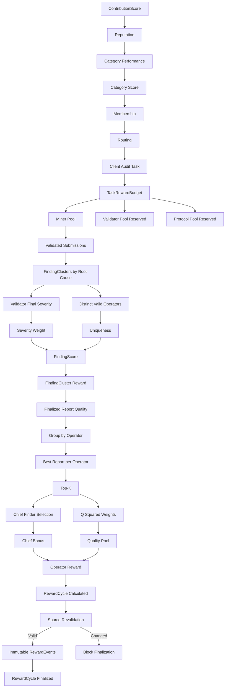

# ProofGuard Week 7 — Scalable Multi-Agent Reward Report

## 67. Week 7 End-to-End Benchmark

Overall status: **PASS**. All 17 named cases exercised the production Day 1–6 services; the benchmark contains no copied uniqueness, Top-K, Chief, Q², or finalization formula.

## 68. Synthetic Benchmark Scenario

The isolated fixture used `64` routed nodes, `40` operators, `120` submissions and `8` finalized root-cause clusters across `access_control` and `reentrancy`. Fixed UTC timestamps and deterministic IDs make Chief and tie behavior replayable.

| Budget component | Points |
|---|---:|
| Miner pool | 10500.000000 |
| Validator pool (reserved) | 3000.000000 |
| Protocol pool (reserved) | 1500.000000 |

## 69. Benchmark Cases

- [x] `single_finder_full_reward` — 1/1 assertions
- [x] `multiple_equal_duplicates` — 2/2 assertions
- [x] `top_k_large_duplicate_cluster` — 4/4 assertions
- [x] `same_operator_multi_node` — 3/3 assertions
- [x] `early_low_quality_not_chief` — 1/1 assertions
- [x] `better_report_after_chief` — 2/2 assertions
- [x] `chief_outside_top_k` — 2/2 assertions
- [x] `no_chief_redistribution` — 2/2 assertions
- [x] `severity_disagreement` — 2/2 assertions
- [x] `uniqueness_operator_based` — 2/2 assertions
- [x] `category_pool_isolation` — 2/2 assertions
- [x] `undistributed_cluster` — 2/2 assertions
- [x] `task_pool_conservation` — 1/1 assertions
- [x] `double_reward_prevention` — 1/1 assertions
- [x] `source_change_blocks_finalize` — 1/1 assertions
- [x] `partial_crash_recovery` — 1/1 assertions
- [x] `deterministic_replay` — 1/1 assertions

## 70. Economic Invariants

- [x] `budget_split_conservation`
- [x] `category_pool_conservation`
- [x] `cluster_pool_conservation`
- [x] `operator_pool_conservation`
- [x] `task_pool_conservation`
- [x] `one_operator_one_position`
- [x] `top_k_bound`
- [x] `single_chief`
- [x] `chief_in_top_k`
- [x] `operator_based_uniqueness`
- [x] `validator_severity_authority`
- [x] `quality_score_authority`
- [x] `same_node_spam_blocked`
- [x] `invalid_reports_excluded`
- [x] `no_historical_multiplier`
- [x] `network_task_separation`
- [x] `unrelated_global_nodes_ignored`
- [x] `determinism`
- [x] `idempotent_calculation`
- [x] `idempotent_finalization`
- [x] `source_revalidation`
- [x] `crash_recovery`
- [x] `double_reward_prevention`
- [x] `all_cases`

The exact task equality is:

```text
9584.680108 finalized RewardEvents
+ 915.319892 undistributed miner points
= 10500.000000 TaskRewardBudget miner points
```

## 71. Determinism Results

Clean-root replay: `passed`. The replay preserved cluster fingerprints, representative submissions, ranks, Chief identities, exact rewards, cycle fingerprints and deterministic RewardEvent IDs. A separately shuffled 100-report input produced the same operator payout object.

## 72. Source-Revalidation Results

Source-change blocking: `passed`. Superseding a finalized quality assessment after calculation changed Day 5/cycle inputs, blocked finalization and created no partial RewardEvents.

## 73. Crash-Recovery Results

Partial-finalization recovery: `passed`. After two deterministic events were written and a simulated crash occurred, retry reused those IDs, created only missing events and finalized exact totals.

## 74. Sybil and Duplicate Stress Results

The service-level stress case used 100 valid reports and 50 operator representatives. Top-K remained five. Multi-node reports from one known operator occupied one position, same-node identical retries were rejected, and independent valid duplicates remained eligible history. At `N=200`, uniqueness equaled the configured `0.500000` floor.

## 75. Reward Distribution Example

The following values are copied from the generated benchmark result, not recomputed in this report:

| Cluster | Severity | Operators | U | FindingScore | Cluster reward | Distributed |
|---|---|---:|---:|---:|---:|---:|
| `finding_cluster_11eb8b…` | High | 12 | 0.668011 | 5.344088 | 893.024069 | 893.024069 |
| `finding_cluster_48cc65…` | Medium | 20 | 0.625334 | 1.876002 | 481.945970 | 481.945970 |
| `finding_cluster_70b7e1…` | Medium | 30 | 0.595153 | 1.785459 | 298.359207 | 298.359207 |

For cluster `finding_cluster_11eb8b45edf9b77669864b628cd86975dfa8d79c80aa83e601bb334510159269`, the server selected Top-K=5 and Chief `operator_12`. Its finalized operator events were:

| Rank | Operator | Q | Q² | Chief | Quality reward | Chief bonus | Total |
|---:|---|---:|---:|---|---:|---:|---:|
| 1 | `operator_12` | 0.940000 | 0.883600000000 | yes | 223.834656 | 44.651203 | 268.485859 |
| 2 | `operator_13` | 0.800000 | 0.640000000000 | no | 162.125600 | 0.000000 | 162.125600 |
| 3 | `operator_22` | 0.790000 | 0.624100000000 | no | 158.097792 | 0.000000 | 158.097792 |
| 4 | `operator_21` | 0.780000 | 0.608400000000 | no | 154.120649 | 0.000000 | 154.120649 |
| 5 | `operator_20` | 0.770000 | 0.592900000000 | no | 150.194169 | 0.000000 | 150.194169 |

The full formula chain remains:

```text
Task Miner Pool -> optional Category Pool
FindingScore = validator severity weight * operator-based uniqueness
FindingClusterReward -> one best report per operator -> Top-K
Chief bonus + QualityPool * Q^2 / sum(Q^2)
OperatorReward -> source revalidation -> immutable RewardEvent
```

## 76. Security Review

| Attack | Result | Reason |
|---|---|---|
| Same-node duplicate spam | Mitigated | identical node/finding hash retry is rejected |
| Same-operator multi-node capture | Mitigated for known identity | one representative per operator/cluster |
| Unlimited duplicate payout drain | Mitigated | positive recipients are bounded by Top-K |
| Raw first-finder race | Mitigated | Chief requires quality threshold and structured qualification |
| Low-quality early reporting | Mitigated | below-threshold reports cannot become Chief |
| Reporter severity inflation | Mitigated | cluster validator-normalized severity is authoritative |
| Historical reputation/membership amplification | Mitigated | historical fields do not multiply payout |
| Double finalization | Mitigated | deterministic event IDs and budget-cycle uniqueness |
| Stale-source finalization | Mitigated | finalization recalculates and compares fingerprints |
| Rounding over-distribution | Mitigated | Decimal quantum and largest remainder conserve every pool |
| Multiple fake operator identities | Not solved | operator linkage is not a proof of real-world identity |

Security checklist:

- [x] no raw node-count uniqueness
- [x] no unlimited duplicate payouts
- [x] no same-operator multiple reward positions
- [x] no Chief outside Top-K
- [x] no self-reported severity authority
- [x] no reputation, membership, CategoryScore or ContributionScore payout multiplier
- [x] no false-positive/out-of-scope/unsafe/unsupported/insufficient-evidence reward
- [x] no network/task reward mixing
- [x] no pool over-distribution, stale finalization or duplicate events
- [x] no nondeterministic tie-breaking, host paths or private keys
- [x] no real token transfer or blockchain write

## 77. Known Limitations

1. `operator_id` deduplication is only as strong as operator identity. Multiple fabricated identities need future stake, wallet ownership, identity cost and Sybil analysis.
2. Validator-approved severity and structured quality evidence remain trusted inputs; multi-validator consensus is not implemented.
3. Deterministic root-cause clustering can still false-merge or false-split reports; no semantic ML/LLM classifier is used.
4. RewardEvents are ProofGuard protocol-point accounting records. No token, wallet, bank or blockchain settlement occurs.
5. Validator and protocol pools remain reserved; validator economics and treasury transfer are intentionally absent.

## 78. Week 7 Final Architecture



Five boundaries are explicit: report is not cluster; node is not operator; severity is not report quality; historical performance is not current payout; and client task budget is not network emissions.

## 79. Week 7 Definition of Done

- [x] complete Day 1–6 real-service pipeline benchmark
- [x] deterministic clean-root replay and event identity
- [x] stale economic sources blocked
- [x] partial crash recovery without duplicates
- [x] same-budget double payout blocked
- [x] exact Decimal task conservation
- [x] no new reward formula or settlement integration

Recommended Week 8 refinements are identity/stake hardening, validator consensus, explicit disputes/reversals, private benchmark seeds and broader load profiling. They are recommendations only; none were implemented by Day 7.
