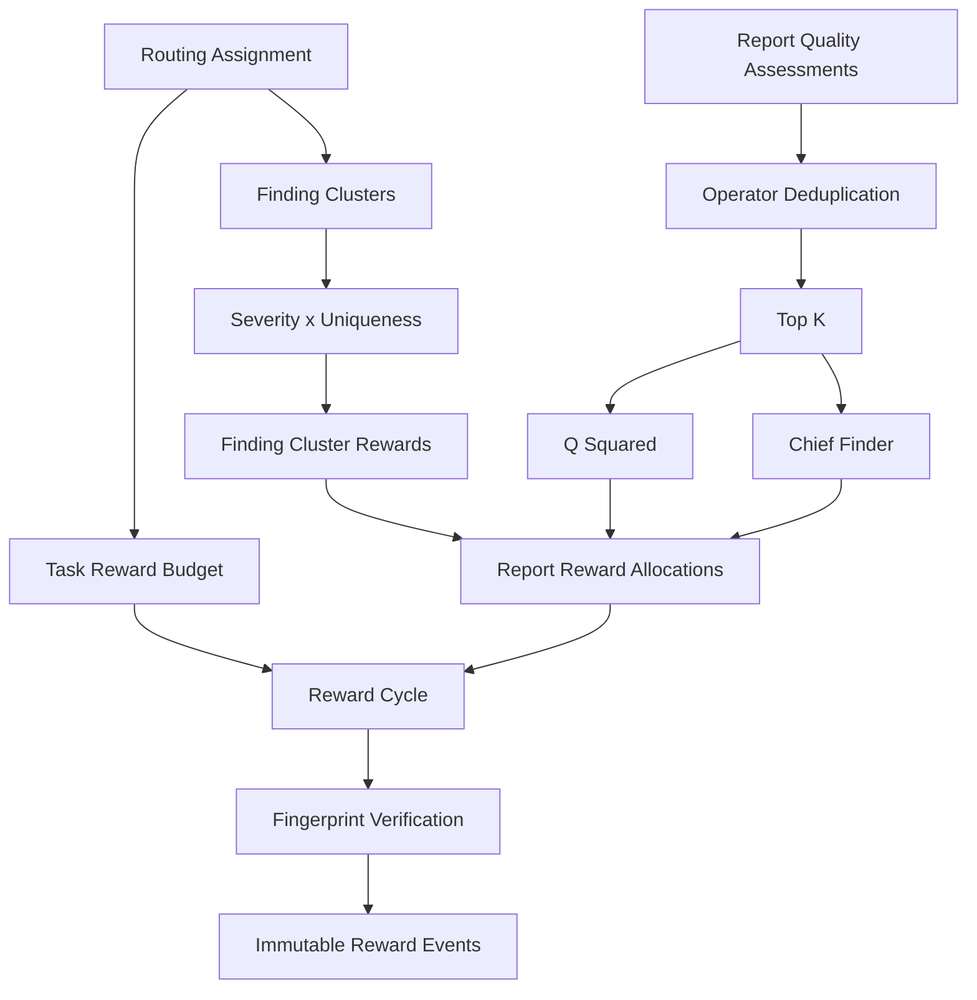

# ProofGuard Week 7 — Final Reward-System Engineering Report

## 1. Executive Summary

Week 7 status: **PASS**. All 33 named benchmark cases passed: `33` passed, `0` failed. Calculations were deterministic, every distributable reward was conserved, no duplicate economic event was detected, no Chief appeared outside Top-K, and no known operator occupied multiple payout slots in one cluster.

Clean replay and insertion-order independence both passed. The canonical economic-state hash is `493630544918b20ab9519a7c92fe8770c2646e5e619a3893377f10e365313a4c`. Historical reputation did not change current-task payout. Regression suite recorded: `passed` (1687 tests, 0 failures).

## 2. Week 7 Architecture



Lifecycle: `draft -> calculated -> fingerprint revalidation -> finalized`. Immutable RewardEvents are the accounting truth.

## 3. Reward-System Principles

| Lane | Question | Inputs | Output |
|---|---|---|---|
| Historical performance | Who deserves future opportunities? | ContributionScore, Reputation, CategoryScore, Membership | Routing eligibility/rank |
| Finding value | How valuable is the validated vulnerability? | Final severity and distinct eligible operators | FindingScore and FindingClusterReward |
| Report quality | How strong is this report? | Typed authoritative quality evidence | Q |
| Reporter payout | Who receives the cluster reward? | Operator grouping, Q, Top-K, Chief evidence | ReportRewardAllocation |

Exact formulas:

```text
Q = 0.35*C + 0.25*P + 0.20*R + 0.10*I + 0.10*F
Critical=16, High=8, Medium=3, Low=1
U(N) = max(0.50, 1 / (1 + 0.20*ln(N)))
FindingScore = SeverityWeight * U(N)
ClusterReward_i = Pool * FindingScore_i / sum(FindingScores)
Reporter quality weight_i = Q_i^2
```

## 4. Benchmark Environment

Runtime: Python `3.14.6`; seed: `7007`; benchmark version: `week7_reward_benchmark_v2`; reward policy: `scalable_multi_agent_reward_v1`; fingerprint version: `reward_cycle_fingerprint_v1`; quantum: `0.000001`.

Command: `python -m research.benchmarks.week7_reward_benchmark`. All production fixtures use temporary isolated roots, fixed UTC timestamps, deterministic IDs, synthetic metadata, and no external target or reproduction execution.

## 5. Dataset / Synthetic Network

The CI-safe real-service scenario used `1` project, `1` routing, `2` active categories, `40` operators, `64` routed nodes, `120` submissions, `105` finalized assessments and `8` FindingClusters. It includes 100-report/50-operator and N=1000 calculator stress cases.

The production-service fixture is intentionally smaller than the prompt's 2-project/4-routing recommendation to keep CI runtime bounded. Cross-project/routing rejection remains covered by service/API regressions; the benchmark itself verifies all persisted economic references remain project/routing/budget scoped.

## 6. Report Quality Results

The independent known vector `(1.00, .80, .90, .70, .60)` produced `Q=0.860000`. All finalized Q values and Top-K Q² weights remained in `[0,1]`. Q=0 produced weight zero; an all-zero denominator stayed explicitly undistributed rather than silently equal-sharing.

## 7. FindingCluster / Duplicate Semantics

The fixture contained `107` valid reports beyond the `8` canonical reports and `5` invalid submissions. Independent root-cause overlaps remained valid FindingCluster members even outside Top-K. Same-node replay was rejected and emitted no reward. `duplicate_submission` means replay/spam; `independent_root_cause` means legitimate independent discovery.

A prominent operator-count case used multiple nodes for one operator: report count exceeded distinct operator count, while Day 4 and Day 5 both retained the authoritative operator count. The 100-report stress case resolved to 50 operators and five rewarded positions.

## 8. Severity and Uniqueness Results

The benchmark verified `U(1)=1.000000`, monotonic decrease through N=2/5/10/50, and the `0.500000` floor through N=149/250/1000. For identical N, Critical > High > Medium > Low. A Critical at the uniqueness floor scores exactly 8, equal to a unique High.

## 9. Cluster Reward Allocation

The independent 10,000-point global case (High N=1, Critical N=4, Medium N=12) produced the expected `B > A > C` ordering and conserved exactly `10000.000000`. The integrated scenario used isolated access-control and reentrancy category pools; no category consumed another category's points. A separate explicit empty-category case retained its entire 4000-point pool without cross-category reassignment.

| Cluster | Severity | Operators | U | FindingScore | Reward | Distributed | Conserved |
|---|---|---:|---:|---:|---:|---:|---|
| `finding_cluster_11eb…` | High | 12 | 0.668011 | 5.344088 | 893.024069 | 893.024069 | yes |
| `finding_cluster_48cc…` | Medium | 20 | 0.625334 | 1.876002 | 481.945970 | 481.945970 | yes |
| `finding_cluster_70b7…` | Medium | 30 | 0.595153 | 1.785459 | 298.359207 | 298.359207 | yes |
| `finding_cluster_9014…` | Critical | 1 | 1.000000 | 16.000000 | 4110.409012 | 4110.409012 | yes |
| `finding_cluster_9e58…` | Critical | 4 | 0.782927 | 12.526832 | 2093.296832 | 2093.296832 | yes |
| `finding_cluster_b21a…` | Low | 30 | 0.595153 | 0.595153 | 152.895141 | 152.895141 | yes |
| `finding_cluster_c612…` | High | 10 | 0.684689 | 5.477512 | 915.319892 | 0.000000 | yes |
| `finding_cluster_eef5…` | High | 5 | 0.756494 | 6.051952 | 1554.749877 | 1554.749877 | yes |

## 10. Operator Deduplication

Eligible reports are grouped by authoritative NodeRecord.operator_id. The representative is chosen by highest Q, then earliest submission timestamp, submission ID and node ID. The benchmark proved a later Q=.96 report can represent an operator while its earlier Q=.82 report preserves Chief qualification time.

Known limitation: operator grouping prevents one registered operator's many nodes from capturing several slots, but does not cryptographically prove that two registered operator IDs are controlled by different people.

## 11. Top-K Results

The exact order is: eligible reports -> group by operator -> best report/operator -> Q descending deterministic ranking -> first K. K remained five. Fifty stress operators influenced uniqueness, while only five received positive payout. Non-Top-K reports remained accepted, legitimate cluster members.

Uniqueness happens before Top-K and uses all distinct eligible operators.

## 12. Chief Finder Results

Chief must be Top-K, have Q>=.80, satisfy separate validator-derived root-cause/severity/impact facts, and be earliest by qualifying submission time. Highest Q alone does not select Chief. `rewarded_submission_id` may differ from `chief_qualifying_submission_id`.

Example cluster `finding_cluster_11eb8b45edf9b77669864b628cd86975dfa8d79c80aa83e601bb334510159269` selected Chief `operator_12` from Top-K=5:

| Rank | Operator | Q | Q² | Chief | Quality reward | Chief bonus | Total |
|---:|---|---:|---:|---|---:|---:|---:|
| 1 | `operator_12` | 0.940000 | 0.883600000000 | yes | 223.834656 | 44.651203 | 268.485859 |
| 2 | `operator_13` | 0.800000 | 0.640000000000 | no | 162.125600 | 0.000000 | 162.125600 |
| 3 | `operator_22` | 0.790000 | 0.624100000000 | no | 158.097792 | 0.000000 | 158.097792 |
| 4 | `operator_21` | 0.780000 | 0.608400000000 | no | 154.120649 | 0.000000 | 154.120649 |
| 5 | `operator_20` | 0.770000 | 0.592900000000 | no | 150.194169 | 0.000000 | 150.194169 |

A rank-six early qualifier could not become Chief. Where no Top-K report qualified, Chief Pool was zero and 100% entered the Q² Quality Pool. Chief never created a K+1 recipient.

## 13. Reward Conservation

```text
total budget 15000.000000 = miner 10500.000000 + validator 3000.000000 + protocol 1500.000000
distributed miner 9584.680108 + undistributed miner 915.319892 = miner pool 10500.000000
RewardEvent total 9584.680108 = reporter allocation total 9584.680108
```

Accounting status: `PASS`. Validator and protocol pools were reserved and untouched. Every cluster satisfied distributed + undistributed = cluster reward, with exact Decimal equality and no tolerance.

## 14. Determinism

Clean-root replay: `PASS`. Insertion-order replay: `PASS`. IDs, cluster membership, Q, uniqueness, FindingScores, rewards, representatives, Top-K, Chief, fingerprints and event identities matched. Runtime measurements and generated timestamps are excluded from the economic hash.

Deterministic state hash: `493630544918b20ab9519a7c92fe8770c2646e5e619a3893377f10e365313a4c`.

## 15. Idempotency and Double-Reward Protection

Result: `PASS`. Repeated calculation returned the same fingerprint. Repeating finalize after a lost response returned already-finalized and created zero events. A second cycle could not consume the same TaskRewardBudget.

## 16. Crash / Recovery Tests

Partial event publication: `PASS`. The verifier classified the matching partial set as recoverable; retry reused existing deterministic IDs and wrote only missing events. A complete event set without the final marker was separately recognized and finalized with zero duplicate writes. Same-total event-component corruption was detected read-only and never overwritten.

Final verification status: `clean_finalized`; event set complete: `True`; safe retry needed: `False`.

## 17. Historical Performance Separation

Changing node reputation after calculation did not change the integrated fingerprint, Top-K, Chief, reward values or finalization result. Day 5 contains no Reputation, CategoryScore, Membership or ContributionScore payout multiplier. Those signals remain routing inputs only. A candidate with a stronger current Q can out-earn an expert with a weaker Q once both legitimately participate.

## 18. Performance / Scalability

Timings are observational and intentionally not fingerprinted:

| Stage | Milliseconds |
|---|---:|
| Cluster build | 2121 |
| Quality assessment | 849 |
| Finding value + cluster allocation | 22 |
| Reporter allocation | 135 |
| Integrated cycle calculation | 173 |
| Finalization | 191 |
| Verification | 140 |
| Total benchmark | 13208 |

The scenario also inserted 1,000 unrelated nodes and proved they did not change or force recomputation of the task snapshot. Reward concentration statistics are observational only and do not feed CategoryScore or routing.

## 19. Regression Results

Full regression flag: `PASS`; tests: `1687`; failures: `0`. The benchmark itself passed every invariant below:

- [x] `budget_split_conservation`
- [x] `category_pool_conservation`
- [x] `cluster_pool_conservation`
- [x] `operator_pool_conservation`
- [x] `task_pool_conservation`
- [x] `one_operator_one_position`
- [x] `top_k_bound`
- [x] `single_chief`
- [x] `chief_in_top_k`
- [x] `operator_based_uniqueness`
- [x] `validator_severity_authority`
- [x] `quality_score_authority`
- [x] `quality_weight_range`
- [x] `uniqueness_range`
- [x] `finding_score_range`
- [x] `same_node_spam_blocked`
- [x] `invalid_reports_excluded`
- [x] `no_historical_multiplier`
- [x] `network_task_separation`
- [x] `unrelated_global_nodes_ignored`
- [x] `determinism`
- [x] `insertion_order_independence`
- [x] `idempotent_calculation`
- [x] `idempotent_finalization`
- [x] `stale_quality_revalidation`
- [x] `stale_severity_revalidation`
- [x] `historical_performance_independence`
- [x] `crash_recovery`
- [x] `complete_event_recovery`
- [x] `event_corruption_detection`
- [x] `read_only_verification`
- [x] `double_reward_prevention`
- [x] `all_cases`

## 20. Known Limitations

1. operator_id is application-level grouping, not cryptographic Sybil resistance.
2. Validator-derived severity and quality evidence remain trusted components; independent-validator consensus is future work.
3. Validator and protocol pools remain reserved; Week 7 implements miner/reporter accounting only.
4. RewardEvents are simulated protocol points, not token, wallet, fiat or blockchain settlement.
5. Routing fairness, complementary specialist routing and private qualification benchmarks need longer-term study.
6. Deterministic root-cause clustering can still false-merge or false-split reports.
7. The filesystem ledger uses staged atomic publication and deterministic retry rather than a multi-file database transaction.

## 21. Week 8 Recommendations

Recommended architectural work: validator economics and disagreement handling; stronger operator identity/Sybil resistance; routing-fairness measurement; high-assurance second-round audits; protocol commitments/signatures; broader external synthetic datasets; and real-world shadow testing without economic settlement. No Week 8 mechanism is implemented here.

Week 7 conclusion: historical performance determines opportunity; validated severity and independent discovery determine vulnerability value; current report quality determines reporter competition; the bounded client miner pool limits payout; and finalized immutable RewardEvents are the reproducible accounting truth.

### Named Case Matrix

- [x] `quality_formula_known_vector` (QUALITY) — 1/1 assertions
- [x] `uniqueness_single_operator` (UNIQUENESS) — 1/1 assertions
- [x] `uniqueness_same_operator_multiple_nodes` (UNIQUENESS) — 2/2 assertions
- [x] `uniqueness_many_independent_operators` (UNIQUENESS) — 2/2 assertions
- [x] `severity_ordering` (CLUSTER_VALUE) — 1/1 assertions
- [x] `common_critical_vs_unique_high` (CLUSTER_VALUE) — 1/1 assertions
- [x] `global_cluster_reward_distribution` (ACCOUNTING) — 2/2 assertions
- [x] `category_pool_isolation` (ACCOUNTING) — 3/3 assertions
- [x] `operator_best_report` (OPERATOR_DEDUP) — 2/2 assertions
- [x] `operator_multi_node_top_k_protection` (OPERATOR_DEDUP) — 1/1 assertions
- [x] `top_k_boundary` (TOP_K) — 3/3 assertions
- [x] `top_k_does_not_change_uniqueness` (TOP_K) — 1/1 assertions
- [x] `chief_basic` (CHIEF) — 2/2 assertions
- [x] `chief_best_vs_earliest_qualifying` (CHIEF) — 2/2 assertions
- [x] `chief_early_low_quality` (CHIEF) — 1/1 assertions
- [x] `chief_outside_top_k` (CHIEF) — 3/3 assertions
- [x] `no_chief_quality_pool_fallback` (CHIEF) — 2/2 assertions
- [x] `single_operator_full_cluster_reward` (ACCOUNTING) — 1/1 assertions
- [x] `q_squared_distribution` (ACCOUNTING) — 2/2 assertions
- [x] `zero_q_non_distributable` (ACCOUNTING) — 2/2 assertions
- [x] `historical_performance_reward_independence` (SECURITY) — 2/2 assertions
- [x] `multi_routing_project_isolation` (SECURITY) — 1/1 assertions
- [x] `deterministic_replay` (DETERMINISM) — 1/1 assertions
- [x] `insertion_order_independence` (DETERMINISM) — 1/1 assertions
- [x] `persistence_reload_verification` (LIFECYCLE) — 1/1 assertions
- [x] `stale_severity_blocks_finalize` (LIFECYCLE) — 1/1 assertions
- [x] `stale_quality_blocks_finalize` (LIFECYCLE) — 1/1 assertions
- [x] `reputation_change_does_not_block_finalize` (LIFECYCLE) — 1/1 assertions
- [x] `finalize_retry_no_double_reward` (IDEMPOTENCY) — 1/1 assertions
- [x] `partial_crash_recovery` (RECOVERY) — 1/1 assertions
- [x] `complete_event_set_recovery` (RECOVERY) — 1/1 assertions
- [x] `event_corruption_detection` (SECURITY) — 1/1 assertions
- [x] `full_accounting_conservation` (ACCOUNTING) — 3/3 assertions
