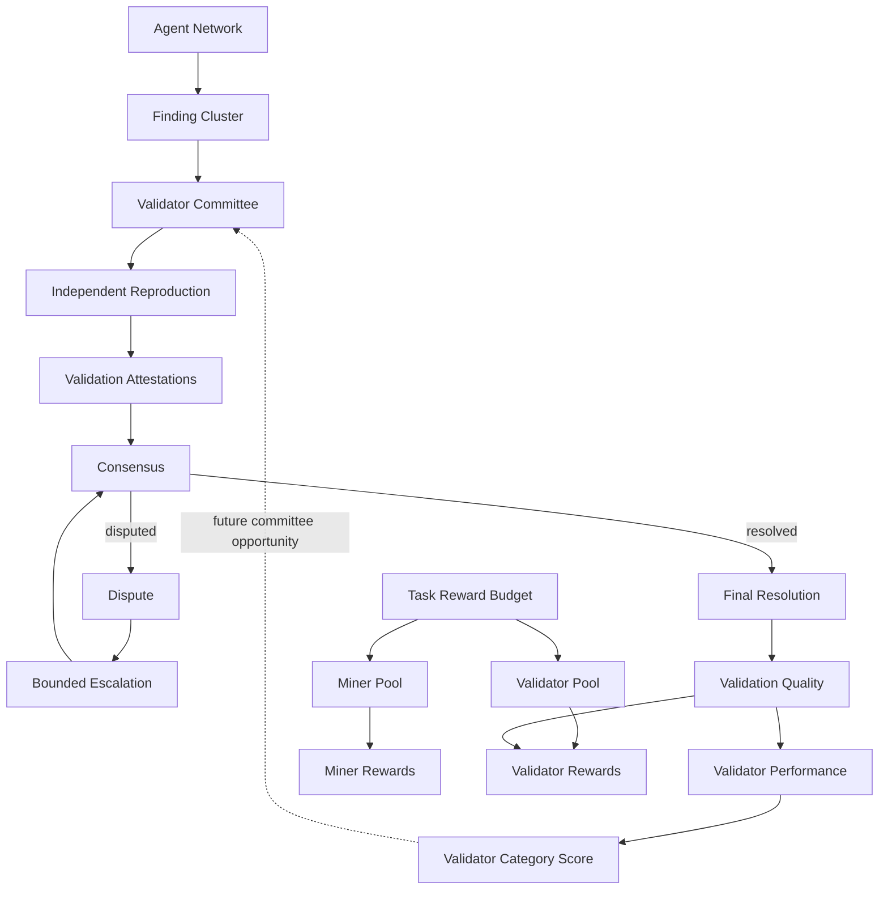

# ProofGuard Week 8 — Validator Network Engineering Report

## 1. Executive Summary

Week 8 status: **PASS**. The benchmark passed `52` of `52` named adversarial cases; failed cases: `none`. Self-validation was blocked, one registered operator never occupied several seats, 3-vs-2 never became terminal truth, and shadow work never changed consensus.

Escalation used new operators, an original minority was demonstrated correct, validator_pool was not overspent, validator finalization did not consume miner_pool or protocol_pool, retry created no duplicate event, and clean replay produced `54485cd3f67efc62b73ebbf5ec8fa82932f18f493144b12e171132f04ff585a2`. Full regression status supplied to this run: `PASS` (1848 tests).

## 2. Week 8 Objective

Week 8 separates discovery from verification: agents propose findings; conflict-free, operator-diverse validators reproduce and attest; supermajority consensus establishes protocol truth; resolved truth then drives validator quality, historical skill, membership and client-funded validator rewards.

## 3. Validator Network Architecture



Historical ValidatorCategoryScore controls future opportunity; it is not a current-task payout multiplier.

## 4. Benchmark Environment

Benchmark `week8_validator_benchmark_v1`, mode `full`, seed `8008`. Each adversarial probe used an isolated temporary protocol root, deterministic UUID/time sources, canonical JSON, real application services, and safe synthetic fixtures. Temporary paths and timings are excluded from state fingerprints.

## 5. Synthetic Validator Network

The `full` corpus represents `1` projects, `40` routings, `6` categories, `40` clusters, `40` reporting operators, `259` validator operators and `268` validator/hybrid nodes. Adversarial corruption cases are intentionally isolated from valid cases.

## 6. Committee Selection Results

STANDARD selected five authoritative operators and optional shadow work remained additional. HIGH_ASSURANCE selected seven when sufficient and failed closed when only six independent operators were available; there was no silent downgrade.

## 7. Conflict-of-Interest Protection

Operator A reported the cluster while another validator node owned by Operator A was eligible by category. Committee planning excluded that node. Conflict-of-interest protection: **PASS**. Reporter exclusion remained active during escalation.

## 8. Operator Diversity

Operator X owned four validator-capable nodes. At most one could occupy an authoritative seat. Ten nodes owned by only four operators could not fill a five-seat STANDARD committee. Diversity is enforced by operator_id, not node_id.

## 9. Independent Reproduction

Authoritative and shadow assignments produced assignment-attributed records through the Day 3 service. Shared source-artifact fingerprints did not merge result identity. Readiness remained operational state, never an implicit verdict.

## 10. SafetyPreflight Regression

The existing synthetic fixture containing a forbidden FFI marker produced `rejected_unsafe`; sandbox launch was instrumented to fail if called and was never reached. Validator, expert, hybrid, high-assurance and shadow roles have no safety bypass. Unsafe artifact does not mean unsafe validator.

## 11. Consensus Results

STANDARD 4-of-5 confirmed, HIGH_ASSURANCE 5-of-7 confirmed, HIGH_ASSURANCE 4-vs-3 disputed, and three authoritative attestations produced NO_QUORUM. Reproduction, severity, root-cause and impact disagreement each independently remained visible and could keep the overall result disputed.

## 12. Why 3-vs-2 Does Not Become Truth

For N=5, quorum is four and supermajority is four. Three ACCEPT versus two REJECT is a narrow majority, not sufficient validation truth, so the production consensus engine returned DISPUTED. ProofGuard does not use naive 51% validation.

## 13. Dispute Resolution

A finalized disputed first round created one bounded escalation opportunity. The planner excluded earlier committee operators and reporters. Insufficient new diversity failed closed; a completed escalation could not open another round for result shopping.

## 14. Escalation 5 to 9 and 7 to 11

STANDARD cumulative N=9 used quorum 8 and threshold 6. HIGH_ASSURANCE cumulative N=11 used quorum 10 and threshold 8. All legitimate Round 1 evidence remained included; Round 2 added four new independent registered operators.

## 15. Minority Validator Analysis

Concrete case: Round 1 was 3 ACCEPT / 2 REJECT and therefore DISPUTED. Four new validators attested REJECT, producing cumulative 3 ACCEPT / 6 REJECT and final REJECTED. The two original REJECT validators were ultimately correct and received VQ `1.000000`; the local-majority label was never a scoring or reward input. ProofGuard rewards truth-seeking, not conformity.

## 16. Validation Quality

The exact all-applicable vector validity=1, reproduction=1, root cause=1, severity=0, impact=1, compliance=1 produced VQ `0.850000`. For a rejected finding with validity, reproduction and compliance applicable and correct, weight renormalization produced `1.000000`, not `.600000`.

```text
VQ = sum(w_i * s_i) / sum(w_i for applicable components)
weights = .35 validity + .20 reproduction + .15 root cause + .15 severity + .10 impact + .05 compliance
```

## 17. Validator Historical Performance

Immutable ValidatorPerformanceEvents rebuilt node/category aggregates. The benchmark verified exact neutral shrinkage for raw .90: 0 samples -> .50, 1 -> .54, 5 -> .70, 10 -> .90. Agent category performance was not used as validator evidence.

## 18. Shadow Validator Cold Start

A correct shadow attestation produced a finalized quality assessment and historical performance evidence while authoritative consensus still counted exactly five votes. Shadow work can advance validator qualification but receives no client validator_pool allocation in v1.

## 19. Validator Reward Economics

| System | Question | Current input | Explicitly excluded |
|---|---|---|---|
| Agent historical performance | Future discovery opportunity | Agent CategoryScore | Validator reward |
| Validator historical performance | Future validation opportunity | ValidatorCategoryScore | Current payout multiplier |
| Current miner payout | Reporter contribution | Finding value, ReportQuality, Top-K, Q², Chief | Validator skill |
| Current validator payout | Assigned verification work | 30% completion + 70% current VQ² | Severity, majority, membership, reputation, historical score |

## 20. Anti-Herding Economic Properties

Validators are paid for authorized completion and accuracy against final truth. They receive no majority-agreement bonus and no dissent penalty. A correct original minority can earn the full quality component, while a wrong original majority receives a lower VQ² component without being classified malicious.

## 21. Reward Accounting

```text
validator_pool 1000.000000 = distributed 910.750000 + undistributed 89.250000
completion total 300.000000; quality total 610.750000
positive RewardEvents 5; event ledger equals distributed: 910.750000
```

Unearned quality and incomplete-seat capacity remain undistributed. Escalation adds work units but never increases validator_pool.

## 22. Miner and Validator Pool Isolation

Pool isolation: `PASS`. Validator finalization consumed validator_pool only; miner_pool and protocol_pool were untouched. Pool-specific consumption prevents a second validator cycle while allowing a separate historical miner stream for the same budget.

## 23. Idempotency and Recovery

Lost-response retry returned the same finalized cycle and existing event set. Injected partial publication was detected, safe retry wrote only missing deterministic identities, and a conflicting same-identity amount caused read-only verification failure rather than overwrite.

## 24. Deterministic Replay

First hash `54485cd3f67efc62b73ebbf5ec8fa82932f18f493144b12e171132f04ff585a2`; replay hash `54485cd3f67efc62b73ebbf5ec8fa82932f18f493144b12e171132f04ff585a2`; identical: `True`; insertion-order independent: `True`. Semantic committees, consensus, VQ, historical scores, memberships, allocations, events and fingerprints matched.

## 25. Performance and Scalability

Timings are observational and excluded from protocol state:

| Stage | Milliseconds |
|---|---:|
| Committee attack probes | 33 |
| Consensus component probes | 585 |
| Quality, performance and reward | 208 |
| Escalation probes | 754 |
| Scale vector probe (280 vectors) | 2347 |
| Total | 9293 |

No fragile micro-benchmark threshold is enforced.

## 26. Security Properties Demonstrated

The benchmark demonstrated registered-operator conflict exclusion, one-seat-per-operator diversity, category eligibility, safe reproduction, multi-dimensional supermajority consensus, bounded new-operator escalation, final-truth quality, shadow cold start, role-separated skill, exact Decimal rewards, pool conservation, immutable-event idempotency and deterministic replay.

## 27. Known Limitations

ProofGuard v1 can enforce one registered operator per committee seat; it cannot cryptographically prove Operator A, B and C are not controlled by one hidden actor. Four genuinely independent-looking operators can compromise a five-seat supermajority if coordinated evidence passes checks. This benchmark does not claim full Sybil/collusion resistance. RewardEvents are simulated points, not real settlement.

## 28. Week 9 Recommendations

Research stronger validator identity and Sybil resistance, cryptographically verifiable committee randomness, signed attestations, challenge mechanisms, complementary implementations/infrastructure, client-selectable assurance profiles, production shadow trials, routing refinements using ValidatorCategoryScore, and carefully scoped staking/slashing research. None is implemented by Day 7.
