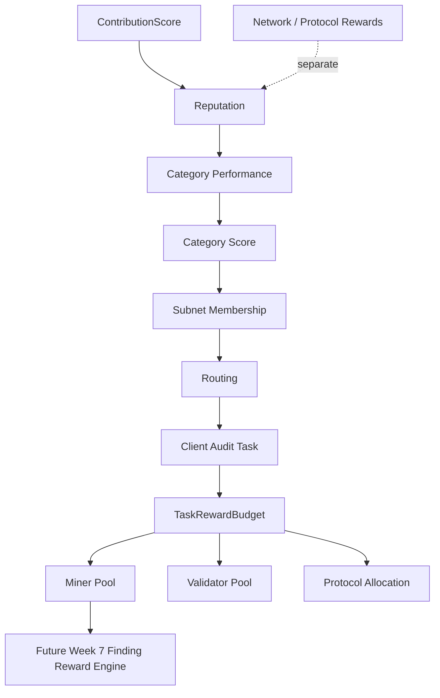
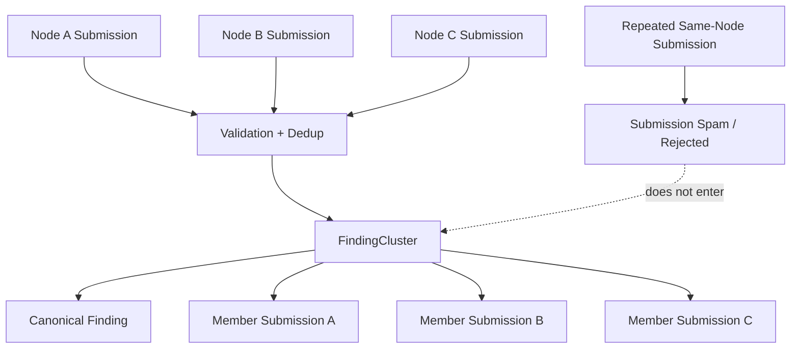
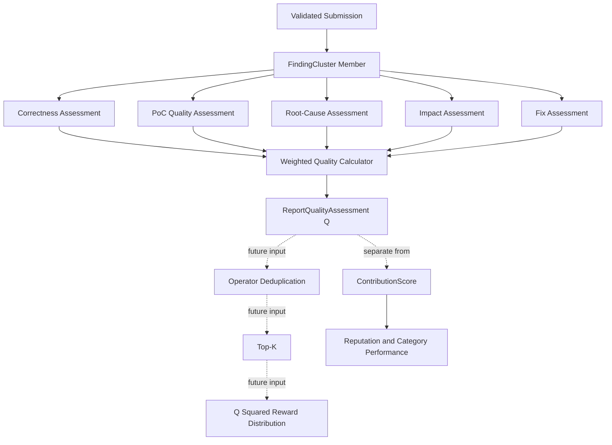
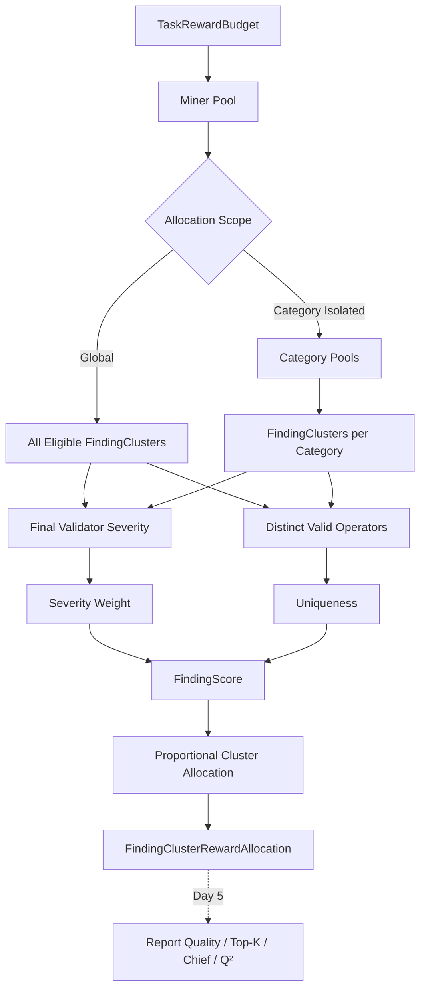
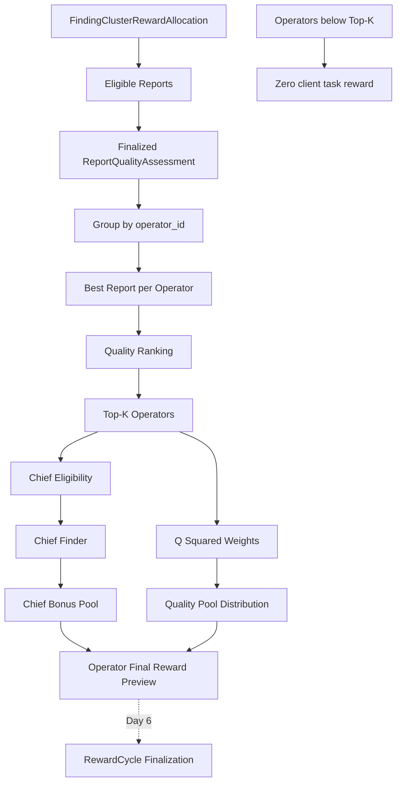
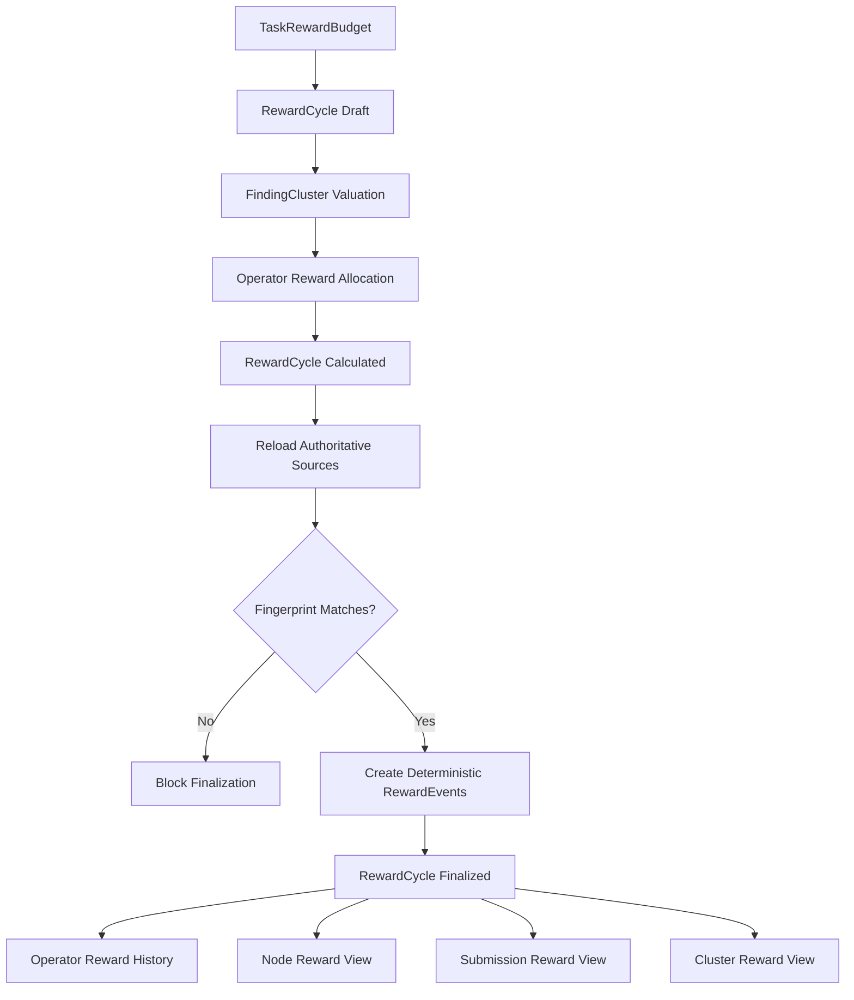
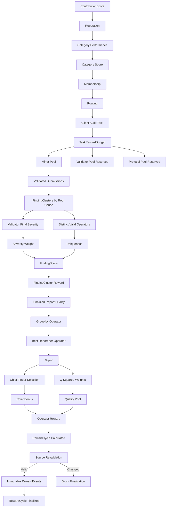

# ProofGuard Week 7 — Scalable Reward System

Status: Week 7 Day 3 report-quality assessment foundation, implemented off-chain.

## 1. Reward Architecture

ProofGuard has two independent reward domains:

```text
                         ProofGuard Rewards
                                |
                +---------------+---------------+
                |                               |
                v                               v
        Client-funded Task Rewards       Network / Protocol Rewards
                |                               |
        one routed audit execution       general network incentives
        bounded client budget            emissions/staking/reputation
        current security work            not task finding payout
```

The invariants are:

```text
client task reward != network protocol reward
performance score != task monetary reward
```

`RewardDomain` serializes these domains as `client_task` and
`network_protocol`. There is deliberately no ambiguous `reward` value. Only the
client-task budget entity is persisted on Day 1; the network value is a domain
boundary, not an implemented emissions system.



## 2. Client-Funded Task Rewards

A client-funded task reward is a fixed simulated `protocol_points` budget for
one audit execution. A finalized `ProjectRoutingRecord` is that execution's
identity because it binds one project scope to the exact assignment set. Two
finalized routings for the same project can therefore have different budgets.

Budget creation only records how much of the total belongs to the miner,
validator, and protocol pools. It does not decide which node earns points and
does not create a `RewardCycle`, `RewardEvent`, transfer, payment, or blockchain
write.

## 3. Network / Protocol Rewards

The `network_protocol` domain reserves a separate vocabulary for future
emissions, staking incentives, validator incentives, participation, or
long-term reputation programs. Day 1 implements none of those mechanisms.
There is no token, currency, wallet, staking balance, emissions schedule, or
network reward event.

Week 5's global Reward Simulator is retained unchanged as the legacy
`reward_v0` project-pool simulation. It is task-shaped rather than an emissions
mechanism, so it is classified as **legacy task reward v0**, not automatically
migrated into either new record type. Its simulated points remain readable.

## 4. Historical Performance vs Current Task Payout

The governing rule is:

```text
Past performance decides who gets the opportunity.
Current contribution decides who gets the task reward.
```

`ContributionScore` remains an individual performance signal. It contains
validity, severity, reproduction, uniqueness, evidence quality, and penalties;
it continues feeding Reputation and category history. It is not the Week 7
client payout. The later finding engine will calculate value at root-cause
cluster level, so paying directly from `ContributionScore` would count severity
and uniqueness twice.

Global Reputation remains long-term node behavior. CategoryScore remains
category-specific historical competence. Membership remains the derived tier
(`candidate`, `probation`, `active`, `expert`, `suspended`, or `removed`). The
Router still uses these records to choose production and exploration
assignments.

Membership does not multiply the new client payout. Membership already affects
selection; an expert bonus in payout would produce the positive-feedback loop
`expert -> selected more -> paid more -> stronger history -> selected more`.
Later task eligibility will instead require an authorized assignment, a valid
current contribution, root-cause cluster membership, and quality evaluation.

The Week 6 benchmark leaderboard remains a performance/routing report. It sorts
by tier, category score, confidence, and historical findings, not by a task
budget. Its reward-points column is an economic statistic and does not determine
the displayed performance position.

## 5. TaskRewardBudget

`TaskRewardBudget` is version `task_reward_budget_v1`, policy
`task_reward_v1`, domain `client_task`, and unit `protocol_points`. It records:

- project and finalized routing identity;
- exact total and three derived pool values;
- the three exact Decimal shares;
- configuration, request, routing-source, and source fingerprints;
- `draft` or `finalized` status; and
- UTC creation, update, and optional finalization timestamps.

The URL project is authoritative. A routing owned by another project is a
conflict. One routing can have at most one budget: the same economic request is
idempotent and a different request conflicts. The deterministic budget ID is
derived from the source fingerprint. Description and timestamps do not affect
economic identity.

Records are stored as atomic, human-readable UTF-8 JSON at:

```text
data/protocol/task-rewards/
  budgets/routing/<routing_id>/budget.json
```

Identifiers are path-safe and stored records expose no host path.

## 6. Budget Pool Split

The centralized configuration defaults for development are:

```text
miner_share     = 0.70
validator_share = 0.20
protocol_share  = 0.10
```

Environment configuration uses
`AUDIT_API_TASK_REWARD_MINER_SHARE`,
`AUDIT_API_TASK_REWARD_VALIDATOR_SHARE`, and
`AUDIT_API_TASK_REWARD_PROTOCOL_SHARE`. Per-task share overrides are accepted
only through the validated `pool_split` request object. Derived pool point
values are never client inputs.

Every share is an exact `Decimal` in `[0, 1]`, and the exact sum must be `1`.
Malformed configuration fails rather than being normalized. The existing Week
6 maximum of `1000000000.000000` protocol points and quantum `0.000001` apply.

`split_task_reward_budget` reuses the Week 6 largest-remainder allocator. It
rounds initial allocations down to the quantum, then assigns residual units by
largest fractional remainder, larger share, and stable
miner/validator/protocol identifiers. Input map order cannot affect output.

```text
miner_pool + validator_pool + protocol_pool == total_task_budget
```

This holds exactly at six-decimal protocol-point precision.

## 7. Relationship with Week 5 Rewards

Week 5 `RewardCycle`/`RewardEvent` records and their `reward_v0` formula remain
unchanged and readable. That legacy formula uses ContributionScore, global
Reputation multiplier, and the v0 category multiplier to divide a project
pool. Day 1 does not rewrite old JSON or create a migration.

The Week 5 lifecycle remains valuable for auditability, source revalidation,
idempotent finalization, and immutable events. A later Week 7 day will connect
the new miner pool to actual distribution through an existing-compatible
reward-cycle lifecycle.

## 8. Relationship with Week 6 Subnet Rewards

Week 6 `subnet_reward_v0` and `subnet_reward_policy_v0` are explicitly legacy
task allocation semantics. Their current formula is:

```text
contribution_score * category_score_multiplier * membership_multiplier
```

Those persisted cycles and events remain unchanged and readable. Existing
`CategoryPoolAllocation` and its exact category pooling are retained so a
future policy may feed the task miner pool through explicit category weights.
A future global cluster policy may bypass category weighting. Day 1 chooses
neither.

New `task_reward_v1` budgets never invoke global Reputation,
category-score, membership, active, probation, or expert payout multipliers.
These legacy multipliers are preserved only for v0 compatibility.

## 9. Reward Lifecycle

The new budget lifecycle is intentionally small:

```text
TaskRewardBudget: draft -> finalized
```

A draft has a fixed economic identity and may only be reused or finalized by
the Day 1 API. Finalization makes it terminal and immutable.

Actual allocation keeps the existing lifecycle:

```text
TaskRewardBudget
        |
        v
miner_pool
        |
        v
future cluster calculation
        |
        v
RewardCycle: draft -> calculated -> finalized
        |
        v
RewardEvents
```

No Day 1 operation crosses from the first lifecycle into the second.

## 10. Day 1 Limitations

Day 1 does not implement FindingCluster, root-cause or semantic grouping,
severity weights, uniqueness formulas, report quality or Q/Q², Top-K, Chief
Finder, operator-level deduplication, validator consensus/economics, candidate
reward rules, payment, currency, tokens, wallets, transfers, staking, slashing,
emissions, participation rewards, or blockchain operations.

The miner, validator, and protocol values are accounting pools only. Validator
and protocol pool distribution policy is deliberately unspecified.

## 11. Next Steps

Days 2–5 can add the current-task finding/cluster value model without changing
the budget identity or old cycles. A later integration can use the miner pool
as the bounded input to an existing-compatible RewardCycle and preserve source
validation and immutable events. Network incentives must be designed under the
separate `network_protocol` domain.

## 12. Root-Cause Clustering

Week 7 Day 2 adds a deterministic derived grouping between validation and the
future task reward engine:

```text
Finding:
    technical report content

Submission:
    protocol act linking a node/operator to that report

FindingCluster:
    canonical unique root cause shared by one or more valid submissions
```

Only accepted, in-scope, successfully reproduced reports from one finalized
routing task are eligible. Rejected, out-of-scope, unsafe, unsupported, and
insufficient-evidence reports are excluded. The cluster builder does not
revalidate technical truth; it consumes the Week 4 validation and dedup
decisions.



## 13. FindingCluster

`FindingCluster` version `finding_cluster_v1` belongs to exactly one project,
one finalized `ProjectRoutingRecord`, and one vulnerability category. It stores
the canonical finding/submission, validator-approved final severity, existing
dedup root identity, individually attributable members, report count, distinct
operator count, lifecycle, and deterministic source fingerprint. It contains
no reward, quality rank, uniqueness formula, Chief Finder, wallet, key, or
payment field.

Each `FindingClusterMember` snapshots submission, finding, node, registry
operator, validation, reproduction, immutable submission timestamp, relation,
and member source fingerprint. Its relation is `canonical` or
`independent_duplicate`; submission spam is not a member relation.

## 14. Duplicate Semantics

The legacy/simple interpretation `duplicate = bad` was too coarse for a large
multi-agent network. Week 7 separates validation truth from the duplicate
relation:

```text
repeated submission spam
!=
independent discovery of the same root cause
```

New reproduced, in-scope root-cause matches use `validation_status = accepted`
with `duplicate_kind = independent_root_cause`, `is_valid_duplicate = true`,
and the Week 4 `duplicate_of` canonical reference. The persisted
`ValidationStatus.DUPLICATE` enum remains readable for historical records; old
records without precise metadata remain ambiguous and are not guessed into
reward-relevant clusters.

## 15. Submission Spam vs Independent Discovery

The Week 5 guard still rejects the same node, project, and canonical finding
hash before a second `SubmissionRecord` is created. Such a retry does not enter
a cluster and cannot change `report_count` or `distinct_operator_count`.

Different nodes may submit independent reports of the same valid root cause.
With 100 agents, many competent agents can find the same obvious High or
Critical flaw; this is useful corroboration, not automatic malicious behavior.
These reports remain separate immutable submissions and can share one cluster.

Week 5 `reward_v0` remains unique-new-vulnerability-only. Consequently a valid
independent duplicate keeps a positive diagnostic ContributionScore but is not
made eligible for that legacy payout. It follows the accepted reputation path
instead of `duplicate_finding`, so it is not automatically penalized.
CategoryPerformance records it as `accepted_independent_duplicate_submissions`.
The precise `submission_duplicate_spam` counter is separate; legacy
`duplicate_submissions` remains readable. CategoryScore never counts the new
accepted-independent bucket as the spam penalty source. For old v0 performance
records that have no precise spam count, the legacy duplicate count remains a
documented compatibility fallback.

## 16. Canonical Finding Selection

The builder first reuses the Week 4 `duplicate_of` canonical relation when that
canonical is a member of the routed task. A cross-task canonical reference may
identify the technical root but cannot become the new task's member; the local
canonical is then selected by reproduced status, immutable submission time,
finding ID, and submission ID. Reputation, membership tier, reward data, and
future report quality never participate.

Cluster severity is the canonical `ValidationDecision.evidence.normalized_severity`.
Reporter-provided severity is not authoritative. Final reports omit accepted
independent copies when their canonical report is present, preserving one
client-visible vulnerability per represented root cause; historical
`duplicate` report sections remain readable.

## 17. Operator Attribution

Every member resolves `submission.node_id -> NodeRecord.operator_id`. A client
cannot submit an operator identity. Multiple nodes owned by one operator remain
separate members, but `distinct_operator_count` deduplicates the registry
operator ID. Missing operator identity fails rebuild rather than falling back
to node count.

## 18. Cluster Persistence and Fingerprints

Current task snapshots are stored atomically as human-readable JSON:

```text
data/protocol/finding-clusters/tasks/<routing_id>/
  index.json
  <finding_cluster_id>/cluster.json
```

The deterministic ID is `finding_cluster_<sha256>` over cluster version,
project, routing, category, and the root-cause fingerprint. The root-cause
fingerprint hashes the normalized Week 4 dedup identity: dedup key, category,
contracts, functions, and normalized canonical root cause. It excludes node,
operator, submission ID, timestamps, severity claims, reputation, membership,
reward, and quality values. This is identity materialization, not a second
classifier.

The cluster source fingerprint covers policy versions, task/project/category,
root identity, canonical IDs, accepted validator severity, and ordered member
source snapshots. Membership, canonical severity, or operator attribution
changes the source fingerprint. Generated rebuild timestamps do not. Identical
sources return existing records without rewriting them. A task index defines
the current deterministic snapshot while older derived files can remain for
auditability. Finalized clusters reject source mutation.

The API is protocol-derived:

```text
POST /projects/{project_id}/routing/{routing_id}/finding-clusters/rebuild
GET  /projects/{project_id}/routing/{routing_id}/finding-clusters
GET  /projects/{project_id}/routing/{routing_id}/finding-clusters/{cluster_id}
GET  /submissions/{submission_id}/finding-cluster
```

There is no client endpoint to add members, choose a canonical finding, or set
severity.

## 19. Day 2 Limitations

Deduplication remains the deterministic Week 4 field-similarity heuristic; it
does not prove semantic equivalence. Day 2 does not merge across categories and
adds no ML/LLM judge, dispute workflow, or manual cluster editor. Historical
`duplicate` decisions without new metadata remain intentionally ambiguous.
Complex finalized split/merge governance is deferred; finalized clusters are
conservative and immutable.

Day 2 distributes no rewards. The future contract is only:

```text
FindingCluster
        |
        +--> final severity
        |
        +--> distinct eligible operators
        |
        +--> member reports
        |
        v
Future Week 7 Reward Engine
```

Future uniqueness will use `distinct_operator_count`, and future Top-K will
consider the best report per operator. Day 2 implements neither. It also does
not implement severity weights, uniqueness/floors, FindingScore,
FindingReward, quality dimensions, Q², Top-K, Chief Finder or bonus, client or
validator payout, token transfers, staking/slashing, emissions, random routing,
committee selection, or blockchain writes.

## 20. Report Quality Assessment

Week 7 Day 3 introduces `ReportQualityAssessment`, a separate, first-class
record for each eligible report in a `FindingCluster`. It answers:

```text
How complete, correct, and useful is this particular report compared with
other reports describing the same accepted root cause?
```

It does not measure historical node skill. It is not a reward and does not
allocate any part of `TaskRewardBudget`. A quality operation never creates a
`ContributionScoreRecord`, `ReputationEvent`, or `RewardEvent`, and never
changes Reputation, CategoryScore, membership, routing, cluster identity, or
canonical severity.

An assessment stores project/routing/cluster/submission/finding identity,
registry-derived node and operator identity, immutable submission time, source
record IDs and fingerprints, five auditable component assessments, server-
derived Q, method, policy/configuration versions, lifecycle, supersession
links, and UTC timestamps. It contains no rank, Top-K flag, Chief Finder flag,
reward amount, wallet, key, or payment field.



## 21. ContributionScore vs ReportQualityAssessment

The records intentionally coexist:

```text
ContributionScore:
    historical value of one contribution event to node performance

ReportQualityAssessment:
    current-task quality of one report within its root-cause cluster
```

The Week 5 score retains validity, severity, reproducibility, uniqueness,
quality, and penalties. Its legacy quality value remains the 10-point
completeness heuristic: meaningful root cause, attack path, impact,
recommendation, and combined contract/function location each contribute two
points. PoC evidence remains in the legacy reproducibility component.

Report quality does not read the final ContributionScore. Both branches read
the underlying Finding, ValidationDecision, and ReproductionResult. This avoids
a circular dependency and prevents cluster severity and uniqueness from being
counted twice in future task payout:

```text
Validation / Reproduction / Finding
        |
        +--> ContributionScore --> Reputation and category history
        |
        +--> ReportQualityAssessment --> future task finding engine
```

## 22. Quality Components

The only component names in policy v1 are `correctness`, `poc_quality`,
`root_cause_quality`, `impact_quality`, and `fix_quality`. Every assessed value
is an exact Decimal in `[0, 1]`. External floats, negative values, values above
one, NaN, Infinity, unknown component names, and values beyond six decimal
places fail validation; malformed inputs are not clamped.

Each component persists its score, exact weight, weighted value, source,
sorted reason codes, sorted evidence references, policy version, and state.
States are `assessed`, `not_assessed`, and `not_applicable`. Policy v1 normally
requires all five to be `assessed`; an incomplete record stays `draft` and has
no Q. Missing data never defaults to a perfect score.

## 23. Correctness

Correctness weight is `0.35`. A report can receive the deterministic baseline
`1.000000` only after it is an accepted, explicitly in-scope, successfully
reproduced cluster member. This includes an accepted independent duplicate
with `duplicate_kind=independent_root_cause` and valid canonical linkage.

Rejected, legacy duplicate, out-of-scope, unsafe, unsupported,
insufficient-evidence, review-pending, and same-node replay submissions cannot
finalize an assessment. The node cannot self-declare correctness through the
submission API. A trusted validator may provide a nuanced structured score
through the dedicated protocol operation; ProofGuard still validates and
weights it.

## 24. PoC Quality

PoC quality weight is `0.25`. Policy v1 consumes the stored
`ReproductionResult`; text containing the word “PoC” is irrelevant.

- `1.000000`: status is `reproduced` and the result contains a PoC file, target
  test name, command, and captured output.
- `0.750000`: status is `reproduced`, but execution metadata/evidence is
  partial.
- `0.000000`: reproduction is missing, failed, timed out, unsafe, unsupported,
  or otherwise not reproduced.

Cluster eligibility already requires successful reproduction, so the zero
outcomes are exposed by the pure evaluator and rejected by finalization. A
validator may replace the baseline with a reviewed structured score and reason.

## 25. Root-Cause Quality

Root-cause quality weight is `0.20`. The deterministic evaluator trusts the
existing validation/dedup cluster relation; it does not use semantic AI.

- `1.000000`: meaningful explicit root-cause text plus an affected contract or
  function, with cluster membership confirming the canonical relation.
- `0.500000`: meaningful root cause but no affected component/function.
- `0.000000`: missing or placeholder root cause.

A reporter's unrelated self-assertion cannot change cluster identity. The
quality layer does not regroup reports or choose a canonical finding.

## 26. Impact Quality

Impact quality weight is `0.10`. The accepted severity is read from the
cluster's validator-approved normalized severity; the reporter's severity is
not authoritative and severity normalization is not rerun.

Current validation records do not contain a structured assertion that
arbitrary impact prose fully justifies that severity. Therefore meaningful
impact text receives only the conservative baseline `0.500000`; missing or
placeholder impact receives `0.000000`. Full or other nuanced values require
validator-supplied structured assessment. A reporter saying “Critical” does
not automatically earn full impact quality.

## 27. Fix Quality

Fix quality weight is `0.10`. Current records have recommendation prose but no
structured fix validator. Non-empty prose cannot establish that a fix addresses
the root cause, is actionable, avoids symptom hiding, or is safe. The
deterministic evaluator therefore leaves fix quality `not_assessed`, records
`validator_fix_assessment_required`, and keeps the assessment in draft.

A trusted validator can supply a normalized fix score, reason codes, and
evidence references. ProofGuard does not infer remediation quality through
keyword counts and does not run an LLM.

## 28. Assessment Methods

`assessment_method` is explicit:

- `deterministic`: assessed values all come from protocol records and v1 rules;
- `validator_supplied`: all five values come from structured validator input;
- `hybrid`: validator input and deterministic components are combined.

The dedicated write API is a validator/protocol operation, not a miner
self-reporting field. The current centralized MVP has no cryptographic API
authentication or validator quorum, so trusted deployment authorization is an
honest operational limitation. Node and operator IDs are never accepted from
the request; they are resolved from SubmissionRecord and NodeRecord.

## 29. Quality Formula

The centralized configuration defaults are:

```yaml
reward:
  quality:
    correctness: 0.35
    poc_quality: 0.25
    root_cause: 0.20
    impact: 0.10
    fix: 0.10
```

Environment overrides use `AUDIT_API_REPORT_QUALITY_*_WEIGHT`. Every weight is
an exact Decimal in `[0, 1]`, and their exact sum must be `1`; invalid
configuration fails instead of being normalized. No model/LLM configuration
or reward amount is part of this policy.

`calculate_report_quality` is pure and uses exact Decimal arithmetic:

```text
Q =
    0.35 * correctness
  + 0.25 * poc_quality
  + 0.20 * root_cause_quality
  + 0.10 * impact_quality
  + 0.10 * fix_quality
```

Only the final Q boundary is quantized, using round-half-even and quantum
`0.000001`. There is no largest-remainder operation for one weighted score.

Complete example:

```text
correctness = 1.00
poc         = 0.80
root cause  = 0.90
impact      = 0.70
fix         = 0.60

Q = 0.35*1.00 + 0.25*0.80 + 0.20*0.90 + 0.10*0.70 + 0.10*0.60
Q = 0.860000
```

The server calculates Q. A request cannot supply Q, rank, reward, Top-K, or
Chief Finder data.

## 30. Assessment Auditability

Storage is versioned, task-scoped, atomic, human-readable JSON:

```text
data/protocol/report-quality/tasks/<routing_id>/submissions/<submission_id>/
  index.json
  assessment-000001.json
  assessment-000002.json
```

The lifecycle is:

```text
draft -> finalized -> superseded
```

A draft can be updated as evidence arrives. A finalized assessment is
immutable for its source fingerprint and policy. Identical reassessment is
idempotent. Changed explicit scores or sources conflict unless the trusted
operation explicitly requests supersession; a complete replacement receives a
new assessment version and the old record remains readable. A finalized record
cannot be downgraded to draft or superseded by an incomplete assessment.

The source fingerprint includes schema/policy/configuration versions, all five
weights, project/routing/cluster/member/submission/finding/node/operator
identity, cluster and member source fingerprints, validation/reproduction IDs
and semantic fingerprints, accepted-severity fingerprint, relevant structured
finding fingerprint, component scores, sources, sorted reasons and evidence,
and derived Q. Component, weight, validation, reproduction, canonical severity,
or cluster-source changes therefore change the fingerprint.

Generated timestamps, host paths, raw source code, admin comments unused in
scoring, reward data, rank, reputation, membership, and routing performance do
not enter the fingerprint. Rewriting an unchanged validation only changes its
timestamp and leaves the quality fingerprint unchanged.

The API is:

```text
POST /projects/{project_id}/routing/{routing_id}/finding-clusters/{cluster_id}/submissions/{submission_id}/quality-assessment
GET  /projects/{project_id}/routing/{routing_id}/finding-clusters/{cluster_id}/quality-assessments
GET  /projects/{project_id}/routing/{routing_id}/submissions/{submission_id}/quality-assessment
POST /projects/{project_id}/routing/{routing_id}/quality-assessments/rebuild
```

Rebuild reads current eligible cluster members, reevaluates deterministic
sources, preserves existing validator-supplied components, writes only changed
records, and reports drafts explicitly. It does not fabricate missing values.

## 31. Day 3 Limitations

1. No LLM quality judge is implemented.
2. Quality is only as strong as available structured validator evidence.
3. Old reports may remain unassessed; no component backfill is invented.
4. Root-cause prose is not semantically evaluated by AI.
5. Fix quality currently requires validator input for finalization.
6. Validator consensus is not implemented.
7. Validator reputation is not used.
8. Quality does not yet distribute rewards or consume TaskRewardBudget.
9. Best-report-per-operator selection is not implemented; every eligible
   report remains independently assessed even when one operator owns multiple
   nodes.
10. Top-K and Chief Finder are not implemented.

Day 3 also does not implement severity reward weights, uniqueness formulas or
floors, FindingScore, FindingReward, category allocation changes, Q-squared
allocation, Chief bonus, task/validator payout, RewardEvent creation, network
emissions, token transfers, staking, slashing, semantic classifiers, validator
consensus, or manual reward overrides.

## 32. Severity Reward Weights

Day 4 answers how much of the finalized client-funded miner pool belongs to
each unique validated root cause. The authoritative severity is
`FindingCluster.final_severity`, derived from the validator-approved Week 4
normalization. Reporter severity, maximum submitted severity, ContributionScore,
reputation, CategoryScore, membership, and report quality are not inputs.

The centralized `finding_cluster_value_v1` defaults are exact Decimals:

```yaml
reward:
  task:
    severity_weights:
      critical: 16
      high: 8
      medium: 3
      low: 1
      informational: 0
```

Informational is explicitly zero: it remains reportable but does not consume
the vulnerability reward pool by default. Unknown severities and negative
configured weights fail; there is no implicit fallback to Low.

Severity answers “how important is the vulnerability?” Report quality answers
“how good is one report of that vulnerability?” Severity controls Day 4 cluster
value; Q controls a future Day 5 report-level split.

## 33. Uniqueness

For `N >= 1` distinct valid operators in one cluster:

```text
U(N) = max(Umin, 1 / (1 + alpha * ln(N)))
```

Defaults are `Umin = 0.50` and `alpha = 0.20`. The implementation uses
`Decimal.ln()` in a fixed 50-digit local Decimal context—never binary float—and
round-half-even to the persisted `0.000001` uniqueness quantum. FindingScore
uses that exact persisted value, so the API explanation reconstructs the
calculation exactly. A configured coefficient of zero makes `U(N) = 1` for all
positive N.

Exact v1 calculator output:

| Distinct operators N | U(N) |
|---:|---:|
| 1 | 1.000000 |
| 2 | 0.878249 |
| 5 | 0.756494 |
| 10 | 0.684689 |
| 50 | 0.561040 |
| 100 | 0.520553 |
| 149 (first floor-bound integer) | 0.500000 |

## 34. Why Uniqueness Uses Operators

`N` is the number of distinct `operator_id` values among valid FindingCluster
members. It is not node count, submission count, committee size, quality
assessment count, Top-K size, or global network size. Three nodes owned by
Operator A and one owned by Operator B therefore give `N = 2`.

Accepted independent duplicates count. Spam, rejected, out-of-scope, unsafe,
unsupported, and insufficient-evidence reports do not become valid cluster
members and do not count. A valid low-Q or not-yet-assessed report still counts:
uniqueness measures independent discovery, not future payout eligibility.

Top-K is later and separate. If 100 valid operators discover a vulnerability
and Day 5 eventually selects five, Day 4 still uses `N = 100`.

## 35. Uniqueness Floor

An unbounded exponential such as `0.9^(N-1)` would drive a genuine
vulnerability close to zero as agent count grows. The `0.50` floor lets rarity
influence value without destroying the economic relevance of a real,
widely-found vulnerability. Under defaults, a very common Critical finding has
FindingScore 8, approximately equal to a completely unique High finding.

## 36. FindingScore

Exactly one score is calculated per FindingCluster:

```text
FindingScore = SeverityWeight * persisted Uniqueness
```

The result is a non-negative Decimal quantized round-half-even to `0.000001`.
A zero-weight Informational cluster remains visible with reason
`zero_severity_weight`, receives zero points, and is excluded from the
proportional denominator. ContributionScore and ReportQualityAssessment are
neither reused nor multiplied into FindingScore.

## 37. Miner Pool to FindingCluster Allocation

For positive-score clusters sharing one parent pool:

```text
FindingReward(Fi) =
    ParentPool * FindingScore(Fi) / Sum(FindingScore)
```

Only `TaskRewardBudget.miner_pool_points` enters Day 4. Validator and protocol
pools are retained as untouched audit snapshots. The budget must be
`client_task` and finalized, and the routing and all participating clusters
must be finalized and linked to the same project/task.

Exact global example for a `10000.000000` miner pool:

| Cluster | Severity | N | U | FindingScore | Allocated points |
|---|---|---:|---:|---:|---:|
| A | High | 1 | 1.000000 | 8.000000 | 3550.684805 |
| B | Critical | 4 | 0.782927 | 12.526832 | 5559.854005 |
| C | Medium | 12 | 0.668011 | 2.004033 | 889.461190 |

## 38. Global vs Category-Isolated Allocation

The pure cluster allocator consumes one parent pool, so two explicit modes are
supported:

- `global`: every eligible task cluster competes for the complete miner pool;
- `category_isolated` (default): the existing Week 6 category largest-remainder
  split runs first, then clusters compete only within their routed category.

ProofGuard keeps category isolation by default because its specialized subnets
encode client/category budget intent:

```text
client miner budget
-> category/subnet pools
-> unique vulnerability allocations
-> future report/operator allocations
```

Equal category weights are used by default; an administrative request may
supply the existing explicit positive weights for every routed category. For
weights 3:2 over a `10000.000000` pool, access control receives `6000.000000`
and reentrancy `4000.000000`. If reentrancy has no positive cluster, its 4000
remains undistributed and is not transferred to access control. In global mode,
no positive findings leaves the entire miner pool undistributed.

## 39. Pool Conservation and Rounding

Day 4 reuses Week 6 exact `Decimal` accounting and largest remainder:

1. calculate exact ideal shares;
2. floor each to the `0.000001` protocol-points quantum;
3. award residual quantum units by fractional remainder descending;
4. resolve equal cluster remainders by `finding_cluster_id` ascending.

For each populated positive-score parent pool, cluster allocations equal that
pool exactly. Empty/zero-score category pools remain undistributed. At task
level the invariant is always:

```text
distributed_cluster_points + undistributed_cluster_points
== TaskRewardBudget.miner_pool_points
```

## 40. FindingClusterRewardAllocation

`FindingClusterRewardAllocation` records project/routing/cluster/category,
cluster fingerprint, final severity and weight, distinct operator count,
persisted uniqueness, FindingScore, zero/positive reason, parent pool type/ID
and amount, allocated cluster points, and an allocation fingerprint.

`TaskFindingRewardCalculation` is a `calculated`/`superseded` snapshot with
policy/configuration versions, budget linkage, allocation scope, optional
category pools, sorted cluster allocations, distributed/undistributed totals,
and source fingerprint. It is not a finalized operator payout cycle.

Persistence is atomic, deterministic, Decimal-safe JSON:

```text
data/protocol/task-rewards/calculations/routing/<routing_id>/finding-allocation/
  latest.json
  <calculation_id>/calculation.json
```

Identical sources reuse the logical record. Changed budget, allocation mode,
category weights, severity configuration, uniqueness configuration, cluster
fingerprint, final severity, or distinct operator count creates a superseding
snapshot. Fingerprints exclude timestamps, ReportQualityAssessment/Q,
reputation, CategoryScore, membership, ranking, RewardEvents, and host paths.

API operations are:

```text
POST /projects/{project_id}/routing/{routing_id}/task-rewards/findings/calculate
GET  /projects/{project_id}/routing/{routing_id}/task-rewards/findings/latest
GET  /projects/{project_id}/routing/{routing_id}/task-rewards/findings
GET  /projects/{project_id}/routing/{routing_id}/task-rewards/findings/{calculation_id}
```

Clients provide only the finalized budget ID and optional scope/category
weights. Severity, operator count, uniqueness, FindingScore, cluster amount,
quality, rank, and payout identity are protocol-derived and forbidden inputs.



Security boundaries: multiple nodes from one operator count once; same-node
spam is excluded by clustering; reporter severity cannot inflate value;
unrelated global node count cannot manipulate N; low-quality flooding matters
only if independent reports actually pass validation; category isolation stops
one category consuming another's assigned pool.

## 41. Day 4 Limitations

Day 4 stops at FindingCluster allocated points. It creates no node/operator
reward, RewardEvent, reputation event, payment, transfer, or budget-consumption
marker. It does not modify ContributionScore, reputation, CategoryPerformance,
CategoryScore, membership, routing, TaskRewardBudget, or quality assessments.

ReportQualityAssessment does not affect cluster amount or its source
fingerprint. Best-report-per-operator, Top-K, Chief Finder/bonus, thresholds,
95/5 split, Q-squared, individual payouts and finalization are deferred. Day 4
also adds no validator payout, network emission, staking/slashing, participation
reward, router change, LLM reward logic, or semantic clustering.

## 42. Operator-Level Reward Allocation

Day 5 consumes each immutable `FindingClusterRewardAllocation` as a fixed
parent amount. It does not recalculate severity, uniqueness, FindingScore,
category pools, or cluster rewards. The active `operator_cluster_payout_v1`
flow is:

```text
Day 4 cluster amount -> finalized Q reports -> operator dedup -> Top-K
                     -> Chief pool + Q² Quality Pool -> operator preview
```

Only current finalized Day 3 assessments participate. Draft, missing,
superseded/stale, unauthorized-assignment, invalid-member, and operator-identity
mismatch reports are retained as auditable exclusions. Accepted independent
root-cause duplicates remain eligible.

Authorized assignment requires exact project, routing, node, category and
assignment-ID linkage. Production and shadow assignments are equally eligible:
candidate, probation, active, and expert membership introduce no Week 7 client
payout multiplier.

## 43. One Operator, One Rewarded Position

Reports are grouped by server-derived `NodeRecord.operator_id` before ranking.
One operator can occupy at most one rewarded position in one cluster, even if
it owns many nodes. For example, Q values `.71`, `.93`, and `.82` from three
nodes owned by Operator A produce one representative: the `.93` report.

Other reports remain persisted and appear with
`superseded_by_operator_best`. This mitigates multi-node flooding but is not
complete Sybil resistance: fake distinct operator identities remain a future
identity, wallet-ownership, staking-cost, and Sybil-detection problem.

## 44. Best Report per Operator

The representative ordering is exact and deterministic:

```text
Q descending
submitted_at ascending
submission_id ascending
node_id ascending
```

`submitted_at` is the immutable Submission Protocol timestamp. Reputation,
membership, CategoryScore, ContributionScore, and reward history are excluded.

## 45. Top-K Policy

Central configuration defaults to:

```yaml
reward:
  task:
    duplicates:
      top_k: 5
```

`top_k >= 1` and the current safety maximum is 1000. Representatives are sorted
by Q descending, submission time ascending, submission ID ascending, then
operator ID ascending. Only the first K can receive positive task reward.

This bounds duplicate payout growth: 500 valid reports still exist as protocol
history, but one root cause has at most five monetary recipients under the
default. Operators below K receive zero with `outside_top_k`; this creates no
negative reputation event and does not alter Day 4 uniqueness.

## 46. Quality Rank

Every operator representative receives a unique ordinal rank from 1 through
the representative count, including operators outside Top-K. `quality_rank`
means report-quality order, not final monetary order. Chief bonus can make rank
2 receive more total points than rank 1 without changing either rank.

## 47. Chief Finder

The Chief Finder rewards early, sufficiently high-quality discovery—not the
first raw submission. Defaults are:

```yaml
reward:
  task:
    chief_finder:
      bonus_percentage: 0.05
      quality_threshold: 0.80
```

The threshold and percentage are exact six-decimal values in `[0,1]`. Chief
identity is still calculated when the configured bonus is zero; its economic
bonus is simply zero.

## 48. Chief Qualification

A Chief-qualifying report must:

- belong to a Top-K operator and be an eligible finalized quality assessment;
- have `Q >= quality_threshold` exactly (`.799999` fails, `.800000` passes);
- be a canonical or accepted independent root-cause FindingCluster member;
- have a positive assessed impact component with an explicit structured reason
  such as `accepted_severity_consistent`; and
- reference the cluster's validator-approved accepted severity.

Cluster membership supplies the validated root-cause relation. Day 5 does not
run semantic classification. Generic `impact_present_consistency_not_structurally_assessed`
is deliberately insufficient for Chief status. A low-Q report may still earn a
Top-K Quality Pool share; the threshold applies only to Chief.

Chief is restricted to Top-K so the maximum positive recipients remains K. An
early qualifying rank-6 operator cannot create a sixth beneficiary.

## 49. Chief Finder vs Best Report

For each Top-K operator, all its eligible reports are inspected and the earliest
Chief-qualified one is selected by submission time then submission ID. Chief is
the earliest of those per-operator candidates, with operator ID as final tie.

The representative and Chief evidence may differ:

```text
Operator A
12:00 Q=.82 -> earliest Chief-qualified submission
12:30 Q=.96 -> best representative and Q² input
```

The allocation therefore persists both IDs. A later `.98` report from another
Top-K operator receives a larger Q² share but does not steal Chief from an
earlier qualified `.90` report.

## 50. Quality Pool

When Chief exists, the existing exact largest-remainder allocator splits the
cluster amount between the configured Chief share and its complement. The
quality amount is derived as `cluster reward - Chief pool`, ensuring:

```text
ChiefBonusPool + QualityPool == ClusterReward
```

When no Top-K report qualifies as Chief, Chief ID is null, Chief pool is zero,
and the complete cluster amount becomes the Quality Pool. No 5% is lost.

## 51. Squared Quality Distribution

For each Top-K representative:

```text
quality_weight_i = Q_i * Q_i

QualityReward_i =
    QualityPool * Q_i² / Sum(Q_j²)
```

Q is the exact finalized six-decimal Day 3 value. Q² is persisted at up to 12
decimal places and never converted to float. Squaring favors stronger reports
without winner-takes-all: `.95²/.70²` is approximately 1.84.

Week 6 largest remainder distributes the Quality Pool at the `0.000001`
protocol quantum. Its existing order uses fractional remainder, larger Q²,
then stable operator/submission identity. Input order cannot affect output.
When total Q² is zero, nothing is equal-split: the entire cluster amount stays
undistributed with `no_positive_quality_weight`.

Exact implementation example:

```text
ClusterReward = 5000.000000
Chief = B (B's qualifying submission precedes A's)
Chief pool = 250.000000
Quality pool = 4750.000000
```

| Operator | Q | Q² | Quality reward | Chief | Total |
|---|---:|---:|---:|---:|---:|
| A | .950000 | .902500000000 | 1202.489481 | 0 | 1202.489481 |
| B | .900000 | .810000000000 | 1079.242637 | 250.000000 | 1329.242637 |
| C | .850000 | .722500000000 | 962.657784 | 0 | 962.657784 |
| D | .800000 | .640000000000 | 852.734923 | 0 | 852.734923 |
| E | .700000 | .490000000000 | 652.875175 | 0 | 652.875175 |

## 52. No-Chief Redistribution

No Chief occurs when all Top-K Q values are below threshold or all structured
impact qualifications fail. The complete cluster reward is then distributed
through Q². If no finalized eligible assessments exist, all are draft, all
assignments fail linkage, or all Q² values are zero, distributed points are
zero and the complete cluster amount remains undistributed. It is never moved
to another cluster or category.

## 53. Cluster Reward Conservation

For every cluster:

```text
sum(operator rewards) + cluster undistributed
== FindingClusterRewardAllocation.cluster_reward_points
```

For the task preview:

```text
task operator distributed + task cluster undistributed
== sum(Day 4 cluster rewards)
```

`OperatorClusterRewardAllocation` exposes representative node/submission,
Q/Q², ordinal rank, Top-K/reward state, distinct Chief-qualifying submission,
quality reward, Chief bonus, total, and exclusion. Report exclusions preserve
non-representatives and ineligible reports. `OperatorTaskRewardSummary` totals
an operator across clusters without collapsing per-cluster history.

Calculated previews are stored atomically under:

```text
data/protocol/task-rewards/calculations/routing/<routing_id>/operator-allocation/
  latest.json
  <calculation_id>/calculation.json
```

The fingerprint includes Day 4 ID/source and exact amounts, routing and cluster
sources, policy/config, assignment IDs, member relation, server-derived
operator, immutable submission time, active assessment ID/source/Q, structured
Chief evidence, representative selection, Top-K order, Chief result, Q² and
allocations. It excludes generated timestamps, reputation, CategoryScore,
membership, ContributionScore, host paths, and future RewardEvent IDs.



Security boundaries include operator grouping against multi-node flooding,
Top-K against duplicate payout explosion, structured Chief qualification
against rushed garbage, and exclusion of reputation/tier multipliers against
historical privilege monopolies. Distinct fake operator identities are not
fully solved.

## 54. Day 5 Limitations

Day 5 produces versioned `calculated`/`superseded` previews only. It does not
finalize a RewardCycle, create immutable RewardEvents, consume TaskRewardBudget,
modify Day 4 values, update ContributionScore/reputation/CategoryScore/
membership/routing, or reorder performance leaderboards.

It implements no wallet/token/real-money transfer, validator or treasury
payout, network emission, staking/slashing, participation reward, adaptive
Top-K/Chief/exponent, commit-reveal, validator consensus, LLM reward decision,
or router change. Day 6 owns source revalidation and final event creation.

## 55. Reward Cycle Integration

Week 7 Day 6 integrates the existing deterministic records without changing
their formulas:

```text
TaskRewardBudget
    -> TaskFindingRewardCalculation
    -> TaskOperatorRewardCalculation
    -> Week7TaskRewardCycle
    -> Week7TaskRewardEvent
```

The policy version is `scalable_multi_agent_reward_v1`. The reward domain is
always `client_task`; legacy network/protocol simulations remain separate.



The complete formula chain is:

```text
Task Miner Pool
    -> optional Category Pool
    -> FindingScore = SeverityWeight * Uniqueness
    -> FindingClusterReward
    -> Best Report per Operator
    -> Top-K
    -> Chief Bonus + Quality Pool
    -> QualityReward_i = QualityPool * Q_i^2 / Sum(Q_j^2)
    -> Operator Reward
    -> immutable RewardEvent
```

## 56. Draft, Calculated and Finalized

`draft` validates and binds one finalized client-task budget to one finalized
routing. It creates no calculations or economic events.

`calculated` references the current Day 4 and Day 5 snapshots and stores an
integrated calculation fingerprint. This state is an auditable preview, not an
economic ledger entry. An explicit recalculation may replace a stale
unfinalized snapshot and records the superseded fingerprint.

`finalized` means all authoritative sources were reloaded, the economic state
still matched, and immutable positive RewardEvents were materialized. A
finalized cycle cannot be recalculated or edited through normal protocol APIs.

The separation allows a complete allocation to be inspected without
immediately committing economic history.

## 57. Calculation Snapshots

The cycle stores references and fingerprints for the TaskRewardBudget,
routing, Day 4 calculation and Day 5 calculation. The integrated fingerprint
also commits to:

- active Day 3, Day 4 and Day 5 policy/configuration identities;
- category scope and weights;
- every cluster reward;
- every representative, rank, Top-K and Chief decision;
- exact Q, Q-squared weights, Quality rewards and Chief bonuses;
- distributed and undistributed miner totals.

Generated calculation timestamps, host paths, reputation, membership and
CategoryScore are excluded.

## 58. Source Revalidation

Finalization never trusts calculated JSON alone. It reloads the finalized
routing and TaskRewardBudget and invokes the same authoritative Day 4 and Day
5 services used for calculation. This reloads finalized FindingClusters,
operator ownership, authorized assignments and current finalized report
quality assessments.

Changes to budget, routing, cluster membership or severity, operator ownership,
Q inputs, Top-K, Chief policy, severity weights, uniqueness parameters or
quality policy/configuration block finalization. No RewardEvent is written
before this comparison succeeds.

## 59. Immutable RewardEvents

Day 6 creates one positive `Week7TaskRewardEvent` per rewarded operator per
FindingCluster. Zero allocations remain in the Day 5 calculation history and
do not create ledger noise.

Each event records the client-task domain, cycle, budget, routing, cluster,
operator, representative node and submission, severity/uniqueness/FindingScore,
Q and Q-squared weight, quality rank, Chief evidence reference, exact Quality
reward, exact Chief bonus and total protocol points.

The representative node is an execution/audit reference. `operator_id` remains
the economic anti-multi-node identity.

## 60. RewardEvent Identity

The deterministic identity is equivalent to:

```text
event_id = SHA256(
    event_version,
    reward_cycle_id,
    finding_cluster_id,
    operator_id,
    rewarded_submission_id,
    policy_version
)
```

The event source fingerprint additionally binds the cycle finalization
fingerprint, Day 4 allocation, Day 5 cluster payout and exact operator amount.
Generated timestamps do not affect either identity.

## 61. Double-Reward Protection

Cycle creation enforces one Week 7 cycle per TaskRewardBudget. The finalizer
independently rejects another finalized cycle or foreign Week 7 RewardEvents
for the same budget. Legacy Week 5/6 events do not falsely block a Week 7
payout because they use different policy versions and economic domains.

Within one cycle:

```text
one cluster + one operator -> at most one positive RewardEvent
one cluster + one representative submission -> at most one positive RewardEvent
positive RewardEvents per cluster <= Top-K
Chief RewardEvents per cluster <= 1
```

## 62. Crash Recovery and Idempotency

RewardEvents use exclusive atomic file creation. On retry, an existing
deterministic ID is accepted only when every economic field matches. A
differing amount, operator, submission or fingerprint is an integrity conflict
and is never overwritten.

If a process writes some events and crashes before updating the cycle, retry
reuses matching events, creates only missing events, rechecks conservation and
then marks the cycle finalized. Repeated finalization returns the same cycle and
events without duplicates.

## 63. Task-Level Conservation

Day 6 validates all nested equalities again:

```text
Day4 distributed clusters + Day4 undistributed = miner pool

Day5 operator distributed + Day5 cluster undistributed
= Day4 distributed clusters

finalized RewardEvents + cycle undistributed miner
= TaskRewardBudget miner pool
```

All values use Decimal and the `0.000001` protocol-points quantum. Empty
categories and clusters without finalized quality remain explicitly
undistributed; finalization never moves their value elsewhere.

Validator and protocol pools remain reserved accounting amounts. Day 6 neither
distributes nor marks those pools paid.

## 64. Legacy Reward Compatibility

Week 5 `RewardCycle`/`RewardEvent` and Week 6 `SubnetRewardCycle` records retain
their schemas, paths, policy versions, multipliers and APIs. Week 7 uses new
`task-rewards/cycles` and `task-rewards/events` paths and does not reinterpret
historical simulations as client-task payments. The JSON protocol store needs
no database migration or historical backfill.

## 65. Economic History vs Performance History

Week 7 provides read-only economic totals by operator, representative node,
submission and FindingCluster. These totals do not modify or rank:

- ContributionScore;
- reputation or ReputationEvents;
- CategoryPerformance or CategoryScore;
- membership tier;
- routing probability.

Task payout is an economic consequence of a current contribution, not a second
performance-scoring event.

## 66. Day 6 Limitations

Day 6 finalizes simulated/client-funded protocol-point accounting only. It does
not implement wallets, token or fiat transfer, blockchain writes, validator
payouts, treasury transfers, network emissions, staking, slashing,
participation rewards, disputes, reversals, appeals, validator consensus or LLM
reward decisions. `operator_id` grouping mitigates multi-node flooding but is
not complete real-world Sybil resistance.

Final invariants:

```text
one operator -> maximum one reward position per FindingCluster
positive rewarded operators per cluster <= Top-K
Chief Finder must be Top-K
sum RewardEvents + undistributed miner amount = miner pool
client task reward != network/protocol reward
task payout != performance score
```

## 67. Week 7 End-to-End Benchmark

Day 7 verifies Days 1–6 through the production services. The benchmark lives at
`apps/audit-api/research/benchmarks/week7_reward_benchmark.py` and writes
deterministic evidence under `apps/audit-api/research/results/week7/`. It does
not copy the uniqueness, Top-K, Chief, Q-squared, or finalization formulas.

## 68. Synthetic Benchmark Scenario

The primary isolated scenario has 64 routed nodes, 40 operators, eight finalized
FindingClusters, two categories, and more than 100 validated reports. It includes
multi-node operators, independent duplicates, invalid outcomes, mixed severity
and quality, an unassessed cluster, and several Chief/no-Chief paths. Protocol,
workspace, and output roots are isolated; IDs and submission times are fixed.

## 69. Benchmark Cases

The machine-readable cases cover single-finder conservation, equal duplicates,
a 100-report/50-operator stress case, operator deduplication, Chief timing and
Top-K restriction, no-Chief redistribution, validator severity, operator-based
uniqueness, category isolation, undistributed clusters, task conservation,
double-reward protection, stale-source blocking, crash recovery, and replay.

## 70. Economic Invariants

```text
category distributed + category undistributed = category pool
cluster distributed + cluster undistributed = cluster reward
sum(final RewardEvents) + miner undistributed = miner pool
one operator = at most one positive position per cluster
positive positions per cluster <= Top-K
Chief count per cluster <= 1 and Chief belongs to Top-K
```

All accounting comparisons are exact Decimal comparisons at the protocol
quantum. No float tolerance is used.

## 71. Determinism Results

The whole pipeline runs from two clean roots. Normalization excludes only
generated metadata timestamps and compares budget/cluster fingerprints, Day 4
and Day 5 economic content, representatives, ranks, Chiefs, amounts, cycle
fingerprints, and RewardEvent IDs. A fixed-seed shuffled stress input also
verifies iteration-order independence.

## 72. Source-Revalidation Results

A cloned calculated cycle receives a superseding quality assessment. Day 6
rebuilds the authoritative snapshots, detects the changed source, blocks
finalization, creates no partial events, and leaves the cycle unfinalized.
Day 6 regressions additionally cover budget, routing, cluster, operator, and
configuration sources.

## 73. Crash-Recovery Results

Finalization is interrupted after a deterministic event subset is written.
Retry derives the same IDs, validates existing content, creates only missing
events, conserves the pool, and finalizes once. Conflicting content under an
expected deterministic ID remains a hard integrity error.

## 74. Sybil and Duplicate Stress Results

Known multi-node operators receive one representative and at most one monetary
position per cluster. The 100-report/50-operator fixture retains 50 operator
representatives but only five positive recipients. Operator-based uniqueness is
tested through its floor at N=200. Fabricated independent operator identities
remain outside this mitigation.

## 75. Reward Distribution Example

The generated `week7_report.md` contains an exact worked example copied from
real calculator output: budget pools, three cluster valuations, a Top-K cluster's
Q, Q-squared weights, ranks, Chief split, event totals, and final conservation.
Generating rather than hand-copying these values prevents precision drift.

## 76. Security Review

The benchmark checks that there is no raw node-count uniqueness, unlimited
duplicate payout, same-operator multi-position payout, Chief outside Top-K,
reporter severity authority, historical multiplier, network/task mixing,
over-distribution, stale finalization, duplicate event, nondeterministic tie,
host-path leakage, private-key persistence, token transfer, or blockchain write.
Rejected, out-of-scope, unsafe, unsupported, and insufficient-evidence reports
create no task RewardEvent.

## 77. Known Limitations

1. Operator deduplication is only as strong as `operator_id`; fabricated
   identities remain future stake/wallet/identity work.
2. Validator-approved severity and structured evidence remain trusted inputs;
   multi-validator consensus is absent.
3. Deterministic root-cause clustering may false-merge or false-split reports;
   no semantic AI classifier is used.
4. RewardEvents are protocol-point accounting records, not settlement.
5. Validator and protocol pools stay reserved because their economics are not
   part of Week 7.

## 78. Week 7 Final Architecture



Five boundaries remain explicit: report is not cluster; node is not operator;
severity is not report quality; performance is not payout; and client task
budget is not network emissions.

## 79. Week 7 Definition of Done

Week 7 is done when the generated invariant matrix and all named cases pass,
clean replay preserves economic identities, stale sources cannot finalize,
crash retry cannot duplicate events, Week 5/6 and Days 1–6 regressions remain
green, and full `pytest` passes. Day 7 adds no adaptive policy, validator
economics, emissions, token payment, wallet action, or blockchain write.
