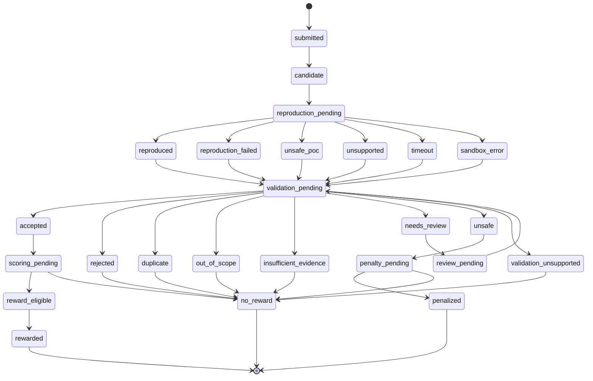

# ProofGuard Protocol State Machine v0

Status: design draft.

## 1. Purpose

This state machine describes the future submission-level orchestration
lifecycle. It does not replace or rename the internal `FindingStatus`,
`ReproductionStatus`, `ValidationStatus`, `ScopeValidationStatus`, or
`DeduplicationStatus` enums in the current MVP. Protocol state is additive: a
future coordinator would store it alongside the existing finding, reproduction,
and validation records and preserve their exact values.

See [Protocol v0](protocol-v0.md) for actor responsibilities and
[message-types.md](message-types.md) for the events that may cause transitions.

Implementation note (Weeks 5 Day 3–6): the off-chain `SubmissionRecord` begins in
`submitted`, and an internal service enforces the implemented subset of guarded
status transitions. Submission creation does not advance the state
automatically. Contribution scoring is now available as an explicit off-chain
calculation that creates a separate record and does not advance submission
state. Reputation processing creates one separate, idempotent event for a
finalized submission and updates only the node's global score and statistics.
The off-chain Reward Simulator may move accepted submissions through
`reward_pending` and moves only finalized, eligible, positive allocations to
`rewarded`. An unsafe submission may move to `penalized` only after a separate
PenaltyEvent is recorded. Reward denial alone does not imply `penalized`.
Automatic orchestration remains future work, and no unrestricted public status,
reward, penalty, or reputation mutation endpoint exists.

## 2. Main lifecycle



The `penalty_pending -> no_reward` branch makes the required review semantics
explicit: an unsafe or rejected artifact can be denied a reward without proving
malice or applying a penalty.

Portable ASCII view:

```text
submitted -> candidate -> reproduction_pending
                              |
                              +-> reproduced -----------+
                              +-> reproduction_failed --+
                              +-> unsafe_poc ------------+
                              +-> unsupported -----------+-> validation_pending
                              +-> timeout ----------------+          |
                              +-> sandbox_error ----------+          |
                                                                   +-> accepted -> scoring_pending
                                                                   |                  |-> reward_eligible -> rewarded
                                                                   |                  +-> no_reward
                                                                   +-> rejected ---------------------------> no_reward
                                                                   +-> duplicate --------------------------> no_reward
                                                                   +-> out_of_scope -----------------------> no_reward
                                                                   +-> insufficient_evidence --------------> no_reward
                                                                   +-> validation_unsupported -------------> no_reward
                                                                   +-> needs_review -> review_pending ------+
                                                                   +-> unsafe -> penalty_pending
                                                                                  |-> penalized
                                                                                  +-> no_reward
```

## 3. State definitions

“Owner” identifies the component responsible for recording or resolving the
state. The future off-chain coordinator persists transitions, but it must not
invent agent, executor, or validator results.

| State | Meaning | Owner/component responsible | Terminal? | Possible next states |
| --- | --- | --- | --- | --- |
| `submitted` | A protocol envelope and candidate finding payload were received but have not passed schema and reference checks. | Protocol Coordinator | No | `candidate` |
| `candidate` | The finding passed the existing finding schema and remains candidate/unverified; it is not accepted. | Finding layer / Agent Node | No | `reproduction_pending` |
| `reproduction_pending` | A PoC is attached or reproduction has been requested and awaits preflight/execution outcome. | PoC Reproduction Layer | No | `reproduced`, `reproduction_failed`, `unsafe_poc`, `unsupported`, `timeout`, `sandbox_error` |
| `reproduced` | The off-chain sandbox returned existing reproduction status `reproduced`; validation is still required. | PoC Reproduction Layer | No | `validation_pending` |
| `reproduction_failed` | The reproduction ran but returned existing status `failed`. This is insufficient evidence, not proof of malice. | PoC Reproduction Layer | No | `validation_pending` |
| `unsafe_poc` | Safety Preflight rejected the artifact with existing reproduction status `rejected_unsafe`; it was not executed. | Safety Preflight / PoC Reproduction Layer | No | `validation_pending`; a new safe attempt must start a new reproduction transition before `reproduced` |
| `unsupported` | The reproduction layer returned existing status `unsupported` for the project, artifact, or tooling. | PoC Reproduction Layer | No | `validation_pending` |
| `timeout` | Sandboxed execution exceeded its allowed duration and returned existing status `timeout`. | PoC Reproduction Layer | No | `validation_pending` |
| `sandbox_error` | The isolated execution environment failed. The normal mapping is existing status `sandbox_error`; the existing enum also has general status `error`. | PoC Reproduction Layer | No | `validation_pending` |
| `validation_pending` | Scope, duplicate, evidence, and severity checks are awaiting a decision or re-evaluation. | Validator Pipeline / future Validator Nodes | No | `accepted`, `rejected`, `duplicate`, `out_of_scope`, `insufficient_evidence`, `needs_review`, `unsafe`, `validation_unsupported` |
| `accepted` | A finalized validation decision has exact status `accepted`. Under current rules it is in scope, not a duplicate, and has `reproduced` evidence. | Validator Pipeline / future decision aggregator | No | `scoring_pending` |
| `rejected` | A finalized validation decision has exact status `rejected`. The schema supports this value even though the deterministic pipeline currently selects more specific outcomes. | Validator Pipeline, manual reviewer, or future aggregator | No | `no_reward` |
| `duplicate` | The decision has exact status `duplicate` and references an already represented vulnerability. | Deduplication Engine and Validator Pipeline | No | `no_reward` |
| `out_of_scope` | The decision has exact status `out_of_scope` under the declared scope. | Scope Validator and Validator Pipeline | No | `no_reward` |
| `insufficient_evidence` | The decision has exact status `insufficient_evidence`; current rules use it for reproduction status `failed`. | Validator Pipeline | No | `no_reward` |
| `needs_review` | The decision has exact status `needs_review`; evidence or scope is non-final or ambiguous. | Validator Pipeline / human review | No | `review_pending` |
| `unsafe` | The decision has exact status `unsafe_poc`, mapped to a distinct protocol name to avoid collision with the reproduction-level `unsafe_poc` state. It does not by itself prove malicious intent. | Validator Pipeline and safety reviewer | No | `penalty_pending` |
| `validation_unsupported` | The decision has exact status `unsupported`, mapped to a distinct protocol name to avoid collision with the reproduction-level `unsupported` state. | Validator Pipeline | No | `no_reward` |
| `scoring_pending` | An accepted, finalized validation decision awaits contribution scoring. The current explicit scorer stores eligibility without changing submission state automatically. | Contribution Scoring Engine v0 / future coordinator | No | `reward_eligible`, `no_reward` |
| `reward_eligible` | Scoring and policy checks found the accepted contribution eligible for simulated reward. This state does not alter validation. The current stored submission equivalent is `reward_pending` before finalization. | Reward Simulator v0 | No | `rewarded` |
| `review_pending` | Additional evidence or human review is required before another validation decision. | Coordinator / human reviewer / future dispute system | No | `validation_pending` |
| `penalty_pending` | Potentially unsafe or malicious behavior is being evaluated. No penalty has been finalized. | Future Penalty Engine plus required reviewer/dispute process | No | `penalized`, `no_reward` |
| `rewarded` | One idempotent reward event was finalized. The Protocol v0 reward is simulated `protocol_points`, not a token transfer. | Reward Simulator v0 | Yes | None |
| `no_reward` | Processing ended without a reward. This is not necessarily a reputation penalty. | Coordinator / future Reward or Penalty Engine | Yes | None |
| `penalized` | An unsafe PenaltyEvent was recorded for required human review. Protocol v0 does not implement real slashing. | Penalty Event v0 / human review | Yes | None |

## 4. Mapping to current MVP statuses

The following mappings use exact values from the repository's current enums.
Protocol aliases only disambiguate lifecycle layers; they do not rename stored
application values.

| Protocol state | Current component | Existing status |
| --- | --- | --- |
| `candidate` | Finding layer | `candidate` / `unverified` |
| `reproduced` | Reproduction layer | `reproduced` |
| `reproduction_failed` | Reproduction layer | `failed` |
| `unsafe_poc` | Reproduction layer | `rejected_unsafe` |
| `unsupported` | Reproduction layer | `unsupported` |
| `timeout` | Reproduction layer | `timeout` |
| `sandbox_error` | Reproduction layer | `sandbox_error` |
| `accepted` | Validation layer | `accepted` |
| `rejected` | Validation layer | `rejected` |
| `duplicate` | Validation layer | `duplicate` |
| `out_of_scope` | Validation layer | `out_of_scope` |
| `insufficient_evidence` | Validation layer | `insufficient_evidence` |
| `needs_review` | Validation layer | `needs_review` |
| `unsafe` | Validation layer | `unsafe_poc` |
| `validation_unsupported` | Validation layer | `unsupported` |

Existing values without a dedicated protocol state in the main diagram are:

| Current component | Existing status | Protocol treatment |
| --- | --- | --- |
| Finding layer | `rejected` | A finding-layer status only; do not confuse it with a `ValidationDecision` having status `rejected`. A future adapter must preserve the source layer. |
| Reproduction layer | `not_attempted` | Remains within `reproduction_pending` until validation chooses `needs_review` or an attempt completes. |
| Reproduction layer | `generated` | Remains within `reproduction_pending`; current validation maps it to `needs_review`. |
| Reproduction layer | `running` | Remains within `reproduction_pending`; current validation maps it to `needs_review`. |
| Reproduction layer | `error` | General existing error with no one-to-one protocol state. A future adapter must preserve `error` and route the submission to validation/review rather than relabel stored data. |

Related exact enums are:

- Scope validation: `in_scope`, `out_of_scope`, `invalid_scope`, `unknown`.
- Deduplication: `unique`, `duplicate`, `possible_duplicate`, `unknown`.
- Severity: `Critical`, `High`, `Medium`, `Low`, `Informational`.
- Severity change: `unchanged`, `upgraded`, `downgraded`.

## 5. Transition rules

1. `submitted -> candidate` occurs only after the current finding schema accepts
   the payload and the referenced project exists. Schema acceptance does not
   validate the vulnerability.
2. `candidate -> reproduction_pending` occurs after a PoC is attached or
   reproduction is requested. A missing PoC can instead cause the validator to
   return existing status `needs_review`; this shortcut is an orchestration
   detail to define before implementation.
3. `reproduction_pending -> unsafe_poc` occurs when Safety Preflight rejects the
   PoC. Rejected code is not executed.
4. `reproduced` does not automatically mean `accepted`. Scope and duplicate
   checks still run and the validation decision remains separate.
5. Under Validator Pipeline v0, `accepted` requires scope status `in_scope`, a
   deduplication result other than `duplicate`, and reproduction status
   `reproduced`.
6. `duplicate` cannot transition to `reward_eligible` as a new finding. Any
   future credit for corroboration must be a separately specified contribution,
   not a new-vulnerability reward.
7. `out_of_scope` cannot transition to `reward_eligible`.
8. Existing reproduction status `failed` maps to validation status
   `insufficient_evidence` under current validator rules.
9. `needs_review` may return to `validation_pending` only after additional
   evidence, corrected scope information, or an authorized review action is
   recorded.
10. Unsafe behavior may enter `penalty_pending`, but an unsafe result alone does
    not prove intent. Ordinary mistakes normally end in `no_reward`, not
    `penalized`.
11. Reward calculation begins only after validation is finalized. Validation and
    contribution scoring remain separate records and concerns.
12. A score may select `reward_eligible` or `no_reward` for an accepted finding;
    it cannot produce or change `accepted`.

## 6. Invalid transitions

The coordinator must reject and record attempts to perform these transitions:

- `candidate -> rewarded`
- `submitted -> accepted`
- `unsafe_poc -> reproduced` without a new safe reproduction attempt
- `duplicate -> reward_eligible` as a new finding
- `out_of_scope -> reward_eligible`
- `needs_review -> rewarded` without finalized validation
- `rejected -> accepted` without a new validation decision
- `scoring_pending -> accepted`
- any transition in which the Reward Engine changes validation status
- any direct transition from an agent-reported confidence or severity to
  `accepted` or `reward_eligible`

A new decision may supersede an old decision only through an explicit,
traceable revalidation or future dispute process. Historical decisions must not
be silently overwritten.

## 7. Idempotency

- Reprocessing the same `message_id` must return the recorded outcome and must
  not create duplicate transitions.
- A transition key should include the submission, prior state, source message or
  decision, and transition type.
- Repeated reward calculation for the same submission, finalized validation,
  and scoring version must not create multiple reward events.
- Future storage must preserve append-only transition history, including failed
  transition attempts and superseding decisions where appropriate.
- Every state change must reference its source message, reproduction result,
  validation decision, review, or scoring event.
- Idempotency does not mean two different agents' duplicate findings are the
  same message. Deduplication and message replay protection are separate checks.

## 8. Failure recovery

| Failure | Conceptual recovery | Current or future |
| --- | --- | --- |
| Coordinator restart | Reload persisted project, finding, reproduction, and validation records; resume only non-terminal protocol work; use message IDs to avoid replayed effects. | Current records exist; protocol transition log is future. |
| Timeout | Preserve reproduction status `timeout`; validate to `needs_review` under current rules; permit a new authorized attempt with a new reproduction/source event. | Current validation behavior; retry policy is future. |
| Sandbox failure | Preserve exact `sandbox_error` or `error`; do not infer vulnerability validity; route to review and retry only in an isolated environment. | Current pipeline handles `sandbox_error` as `needs_review`; general `error` needs an explicit future adapter rule. |
| Validator unavailable | Keep `validation_pending`; apply a bounded retry or select another eligible validator without letting the agent self-validate. | Future node behavior. |
| Partial storage failure | Do not publish a transition until its source record and transition entry are durably committed; reconcile by idempotent message ID. | Future transactional/outbox design. |
| Repeated submission | If the same `message_id`, return the prior result; if different messages describe the same vulnerability, run deduplication and preserve both submission records. | Deduplication exists; protocol replay handling is future. |
| Conflicting validator decisions | Preserve every signed decision, withhold final scoring, and enter review/challenge until an aggregation rule finalizes one result. | Multi-validator conflict resolution is future work. |

Multi-validator quorum, conflict resolution, appeals, challenge windows, and
finality are deliberately unresolved in Protocol v0. No current component
should pretend to provide consensus.

## 9. Subnet membership state machine

Subnet membership is a separate off-chain state machine from the finding and
submission lifecycle:

```text
candidate -> probation | suspended | removed
probation -> candidate | active | suspended | removed
active -> probation | expert | suspended | removed
expert -> active | probation | suspended | removed
suspended -> candidate | probation | active | expert
removed -> removed
```

Automatic restoration from `suspended` is allowed only when the suspension is
not administratively locked and the node, subnet, category, safety, and
performance inputs again qualify. An administratively suspended member remains
locked until a future explicit restore operation exists. `removed` is terminal
under normal refresh and is not automatically re-enrolled.

Promotion uses the current policy threshold. Active and expert demotion use
lower hysteresis thresholds to avoid oscillation. Hysteresis never overrides a
ban, suspension, inactive or archived subnet, unsupported category, recent
unsafe event, or administrative lock. Capacity can downgrade an otherwise
active/expert recommendation to probation, but never promotes a weaker
recommendation. Every new or logically changed evaluation has an immutable
source-fingerprinted decision event; unchanged refreshes create no transition.

## 10. Subnet reward-cycle state machine

Subnet reward allocation has a separate off-chain lifecycle:

```text
draft -> calculated -> finalized
```

`draft` fixes one finalized routing, total simulated protocol-points pool, and
category weights. `calculated` stores category-isolated allocations,
exclusions, node summaries, and the source fingerprint but creates no reward
events. Recalculation is allowed only before finalization and is idempotent
when logical sources are unchanged.

`finalized` is terminal and immutable. Finalization reloads every relevant
routing, submission, validation, reproduction, contribution, node-status, and
prior-reward source. A source mismatch or change prevents the transition.
Successful finalization creates at most one deterministic applied reward event
per eligible submission; replay reuses matching events and never allocates the
same contribution twice.
