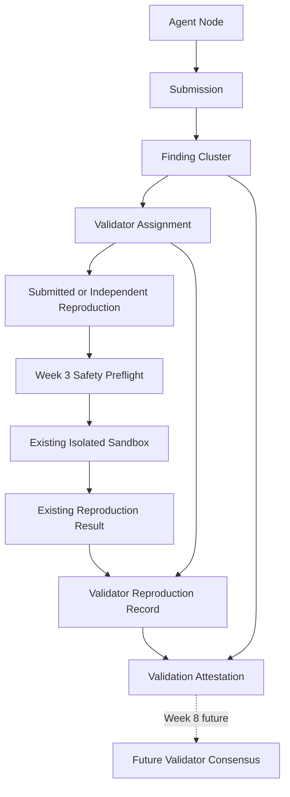

# ProofGuard Validator Attestation Protocol v1

Status: Week 8 Day 1 implemented protocol foundation.

## Principle and scope

**Agents propose claims. Validators independently verify them.** Where a claim
is technically reproducible, validation should include a reproduction attempt
through ProofGuard's existing Week 3 safety preflight and isolated sandbox.

This specification introduces independent validator evidence. Committee
selection is now specified separately by Week 8 Day 2; this Day 1 layer still
does not implement quorum, voting, consensus, validator performance updates,
validator rewards, signatures, wallets, or payments.

## Architecture



Week 8 does not add a Foundry runner, Docker runner, or safety policy. A
`ValidatorReproductionRecord` is a validator-attributed immutable envelope
around an authoritative final Week 3 `ReproductionResult`. PoCs remain
untrusted. Validator, hybrid, expert, or shadow status never bypasses safety
preflight or sandbox restrictions.

## Responsibilities and trust model

| Actor/object | Trust position | Responsibility |
| --- | --- | --- |
| Reporter/agent | Untrusted source of a claim | Creates a finding and submission. |
| PoC | Untrusted code/artifact | May execute only through preflight and sandbox. |
| Validator | Authorized independent evaluator, not ground truth | Produces structured conclusions and evidence provenance. |
| One attestation | Evidence, not final truth | Records one evaluator's immutable statement. |
| Future consensus | Not implemented | Will combine independent evidence. |
| Backend coordinator | Protocol relationship verifier | Enforces authorization, identity, safety linkage, canonicalization, and persistence. |

A validator does not submit a simple YES/NO vote:

```text
ValidationAttestation
    +-- validity decision
    +-- root-cause decision
    +-- authoritative reproduction decision
    +-- proposed normalized severity
    +-- impact decision
    +-- evidence references
    +-- reason codes
    +-- validator node/operator identity
    +-- immutable SHA-256 fingerprint
```

One attestation is not consensus. Disagreement is not automatically bad
behavior; a minority validator may later prove correct.

## Validator identity, assignment, and conflict of interest

`NodeRecord` is authoritative for node ID, operator ID, type, and status. Only
active `validator` and `hybrid` nodes are eligible. Agent-only, inactive,
suspended, and banned nodes cannot create validator evidence.

`ValidatorAssignment` v1 binds one validator node/operator to one finalized
project, routing, and `FindingCluster`. Roles are `authoritative` (future
consensus input) and `shadow` (future performance evaluation only). Its compact
lifecycle is:

```text
assigned -> reproduction_recorded -> attested
    \-> expired
    \-> cancelled
```

Assignment creation is a trusted internal service operation. There is no public
self-assignment endpoint; Day 2 committee finalization creates linked
assignments selected by the protocol.
Assignment identity is deterministic over project, routing, cluster, validator
operator, role, and version. Several nodes owned by one operator therefore
cannot create several authoritative seats for one cluster.

An operator cannot validate a cluster containing any report from that operator:

```text
validator.operator_id NOT IN cluster.members[*].operator_id
```

This applies to validator and hybrid nodes, authoritative and shadow roles, and
all nodes owned by the operator. It is checked at assignment and again before
reproduction or attestation evidence is recorded.

## Independent reproduction provenance

`ValidatorReproductionRecord` v1 distinguishes:

- `submitted_poc`: evaluation of the reporter's submitted artifact in an
  independent validator context;
- `independent_reproduction`: independently prepared reproduction evidence or
  procedure.

No economic weight is assigned to either. The wrapper stores assignment,
cluster and validator attribution, underlying Week 3 result ID, exact status,
optional environment digest, derived PoC digest, and deterministic source
fingerprint. It does not copy stdout, stderr, host paths, container IDs, or
temporary workspace paths.

The current Week 3 store has a final `ReproductionResult` per finding and no
separate persisted `ReproductionRequest`. V1 references that real result rather
than fabricating a request ID. Future Day 3 integration can add immutable
per-validator request/attempt records while reusing the same safety pipeline.

Final statuses remain distinct: `reproduced`, `failed`, `error`, `timeout`,
`unsupported`, `rejected_unsafe`, and `sandbox_error`. Pending Week 3 states
cannot become finalized validator reproduction evidence.

## Reproduction is not validity

Reproduction failure alone does not prove a finding invalid. Supported examples
include `reproduced + accepted`, `failed + insufficient_evidence`, and
`failed + rejected`. Timeout, unsupported, unsafe, and sandbox errors remain
distinct. There is no `failed -> rejected` rule.

The reproduction conclusion is server-derived from the linked wrapper. A
caller cannot claim `reproduced` when the underlying result failed or was
unsafe.

## Structured attestation

`ValidationAttestation` v1 reuses the Week 4 `ValidationStatus` vocabulary for
`accepted`, `rejected`, `out_of_scope`, `insufficient_evidence`, `unsafe_poc`,
and `unsupported`. Root-cause decisions are `confirmed`, `mismatch`, and
`insufficient_evidence`. Impact decisions are `validated`, `rejected`, and
`insufficient_evidence`. Severity reuses `FindingSeverity`.

Accepted statements require a severity opinion. Clearly rejected,
out-of-scope, unsafe, or unsupported statements keep severity undetermined;
`insufficient_evidence` may retain an independent severity opinion.

Reason codes use a closed vocabulary. Evidence references must identify stored
assignment, cluster, cluster-member, validation, or reproduction records.
Mandatory assignment, cluster, validator-reproduction, and underlying-result
references are inserted by the service. Host paths and arbitrary identifiers
are rejected.

## Lifecycle, immutability, and idempotency

Day 1 creates attestations atomically as finalized records. There is one final
attestation per assignment and protocol version. Identical semantic submission
returns the existing record; list order does not affect identity; a conflicting
second statement fails; and finalized evidence has no mutation endpoint.

Attestation never changes `FindingCluster.final_severity`, report quality, Week
7 rewards, reputation, CategoryScore, membership, routing rank, or
ContributionScore.

## Canonical payloads and fingerprints

All commitments use existing `SHA256(canonical_json(payload))` utilities.

- Assignment: version, project/routing identity, cluster source identity, category,
  validator node/operator/type, eligibility status at assignment, and role.
- Validator reproduction: assignment source, all identities, mode, underlying
  result ID/semantic digest/status, PoC digest, and optional environment digest.
- Attestation: assignment and reproduction sources, identities, role, validity,
  root cause, reproduction, severity, impact, sorted reasons/evidence, and
  reproduction link.

Generated timestamps, reputation, CategoryScore, membership, rewards, host
paths, raw output, container IDs, and temporary paths are excluded. The payload
is future-signature-ready. `NodeRecord.public_key` exists, but Day 1 neither
creates nor stores private keys and does not verify signatures.

## Persistence and API

Path-safe, UTF-8, sorted JSON and atomic create/write helpers persist:

```text
validator-protocol/
    assignments/<routing_id>/<assignment_id>.json
    reproductions/<routing_id>/<validator_reproduction_id>.json
    attestations/<routing_id>/<attestation_id>.json
```

The API reads assignments, records/reads reproduction wrappers, submits/reads
attestations, and lists cluster evidence. It cannot set project, routing,
cluster, operator, reproduction status, consensus, final cluster severity, or
rewards. URL and stored relationships are authoritative.

## Failure behavior

- missing assignment/result/cluster: block;
- wrong project/routing/cluster/validator link: relationship conflict;
- inactive or conflicted validator: ineligible;
- pending reproduction: wait for a final Week 3 result;
- mutated result/artifact before attestation: stale-evidence conflict;
- identical finalized submission: idempotent success;
- conflicting finalized submission: block without overwrite;
- unsafe result: preserve `rejected_unsafe`, with no override execution.

## Limitations and future work

- `operator_id` is not cryptographic Sybil resistance.
- Validators are authorized evaluators, not automatically trusted truth.
- Legacy Week 3 stores one mutable result per finding. Day 3 adds a separate
  attributed Week 3 result namespace with one logical result per committee
  assignment while leaving legacy records readable.
- Transport authentication and attestation signatures are future work.
- Validator consensus and disagreement resolution are absent. Committee
  assurance policy is specified by Day 2.
- No validator performance or validator-pool reward exists.
- No real payment, token, wallet, staking, slashing, or blockchain transaction exists.

Week 8 roadmap: Day 2 committee selection and Day 3 independent execution are
implemented; Day 4 consensus/dispute/escalation; Day 5
validator performance and shadow evaluation; Day 6 validator-pool allocation;
Day 7 adversarial benchmark.
