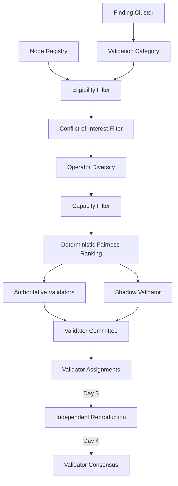

# ProofGuard Validator Committee Selection v1

Status: Week 8 Day 2 implemented.

## Principle and boundary

Committee selection determines **who may independently evaluate a finding**. It
does not determine whether a finding is valid, its severity, or its root cause.
No vote, quorum, majority, consensus, reproduction execution, attestation,
performance update, reward, staking, payment, key handling, or blockchain
operation occurs while a committee is planned or finalized.

Committee members are protocol-selected. The reporter cannot nominate friendly
validators and a validator cannot request a cluster or self-assign.



The dotted future edges are boundaries, not behavior implemented by Day 2.

## Standard and high-assurance validation

`ValidatorCommitteePolicyV1` is immutable and versioned as
`validator_committee_policy_v1`. Defaults are centralized in the policy:

| Mode | Authoritative target | Optional shadow target |
| --- | ---: | ---: |
| `standard` | 5 | 1 |
| `high_assurance` | 7 | 1 |

Authoritative targets are exact and partial committees are forbidden. Five or
seven means five or seven independent operators, not nodes. High assurance
never silently becomes standard. Missing shadow capacity is allowed because a
shadow seat is additional and never replaces an authoritative seat.

The repository currently has no authenticated policy-administration boundary.
Consequently, the public HTTP creation operation is intentionally
STANDARD-only and accepts an empty, extra-forbid request. Trusted internal
orchestration can pass `high_assurance` to `plan_validator_committee`. A public
reporter therefore cannot enlarge its own committee based on claimed severity.

## ValidatorCommittee audit envelope

`ValidatorCommittee` v1 stores:

- committee, project, routing, cluster, validation-round identity, and the full
  immutable policy snapshot;
- the cluster category and assurance mode;
- authoritative and shadow target/actual counts;
- the complete eligible `ValidatorCandidateRank` snapshot;
- ordered authoritative and shadow seats, including deterministic assignment
  IDs;
- candidate-source and final-calculation fingerprints; and
- planned/finalized lifecycle timestamps.

`validation_round` defaults to `1`. Committee identity is deterministic over
project, routing, cluster, round, committee version, and policy version. This
enforces one committee per cluster/round/policy while leaving historical round
1 identity compatible with future round 2 records. Day 2 does not create an
escalation or dispute round.

Seat order is audit and dispatch order only. It creates no voting weight.

## Committee lifecycle

The lifecycle is deliberately compact:

```text
planned -> finalized
```

Planning derives and persists the candidate snapshot and selected membership,
but creates no assignment. Finalization reloads authoritative routing, cluster,
NodeRegistry, category, reporter identity, workload, history, capacity, and
policy state. It recalculates the deterministic plan and requires both source
fingerprints to match. A changed source produces a stale-plan conflict and no
assignment or usage event.

After successful revalidation, finalization creates committee-linked Day 1
`ValidatorAssignment` records, atomically marks the committee finalized, and
then creates validator usage events. Deterministic identities make retry safe.
Finalized membership has no mutation operation.

## Validator eligibility

Every candidate must:

1. exist in `NodeRegistry`;
2. have node type `validator` or `hybrid`;
3. have exact status `active`;
4. declare the `FindingCluster.category` in `supported_categories`;
5. have an operator absent from all authoritative cluster reporters;
6. have no seat already assigned to that cluster and round;
7. remain below the policy's node-level active validator capacity; and
8. survive operator grouping and deterministic representative selection.

Agent-only, inactive, suspended, banned, unsupported-category, conflicted, and
at-capacity nodes are excluded. The registry has no protocol-environment field,
so v1 adds no invented environment restriction.

Validator subnet membership is not required. Current subnet membership and
`CategoryScore` describe the agent/miner production-routing domain, not a
validator qualification domain.

## Category capability

The category comes from the finalized `FindingCluster`; the request cannot
change it. `NodeRecord.supported_categories` is an eligibility declaration,
not proof of expertise. A validator that does not explicitly list the cluster
category cannot be selected by a committee, even though legacy trusted Day 1
assignment creation remains compatible with older validator records that had
an empty declaration.

## Conflict of interest

The service rebuilds the reporting-operator set by loading every valid finalized
cluster member's `node_id` from `NodeRegistry` and reading its current
`operator_id`. It does not accept caller-supplied operator IDs and does not rely
on a cached request value. Since `FindingCluster.members` contains only the
canonical accepted report and accepted independent duplicates, spam-only
submissions do not manufacture a reporter conflict.

If operator O reported the cluster with agent O1, validator O2 and hybrid O3 are
both excluded. The rule applies even though their node IDs differ.

## Operator diversity

Candidates are grouped by authoritative `operator_id`. One deterministic node
represents each operator. Across authoritative and shadow roles combined, an
operator may occupy at most one seat. Several nodes cannot fill an operator
shortage, and duplicate-operator fallback does not exist.

This prevents one registered operator from multiplying seats by registering
nodes. It does not prevent several nominally distinct operators from colluding.
Future mitigations may include economic identity costs, staking and penalties,
validator evidence/reputation, cryptographically verifiable random selection,
larger committees, and dispute escalation. None is implemented here.

## Workload, capacity, and active assignments

Validator workload is derived from persisted `ValidatorAssignment` records and
kept separate from Week 6 `RoutingUsageEvent`. The latter requires agent subnet,
production/exploration, and routing semantics, so mixing validator work into it
would corrupt both domains.

V1 counts `assigned` and `reproduction_recorded` assignments as active, unless
their expiry has passed. `attested`, `cancelled`, and `expired` are terminal and
do not count as current load. The policy default is at most five concurrent
validator assignments per node. Both authoritative and shadow work consume
that node capacity.

History is aggregated at node and operator level. Operator attribution comes
from the immutable assignment snapshot, preventing several nodes from creating
several committee seats and reducing multi-node concentration in turn-taking.

## Deterministic fairness

For multiple eligible nodes owned by one operator, the authoritative
representative order is:

1. lower current validator workload;
2. fewer recent authoritative assignments;
3. oldest or no last authoritative assignment;
4. fewer lifetime authoritative assignments; and
5. node ID ascending.

Authoritative operators are then ordered by:

1. lower operator active authoritative workload;
2. fewer operator authoritative assignments in the recent 30-day window;
3. oldest or no operator authoritative assignment;
4. fewer lifetime operator authoritative assignments;
5. operator ID ascending; and
6. node ID ascending.

There is no random shuffle, set-order dependency, or filesystem-order
dependency. Sequential finalized committees update workload/history, so due
operators rotate ahead of busy ones.

## Authoritative and shadow validators

An authoritative seat is eligible for consumption by a future consensus
engine. Day 2 creates no such engine. A shadow seat gathers future evaluation
evidence but can never reduce the authoritative target or contribute authority.

After authoritative operators are removed, shadow ordering favors:

1. operators with zero historical authoritative assignments;
2. fewer total validator assignments;
3. fewer shadow assignments;
4. oldest or no last shadow assignment;
5. lower current node workload;
6. operator ID ascending; and
7. node ID ascending.

This supplies a deterministic cold-start path without inventing validator
skill. One operator still receives at most one shadow seat.

## Why agent CategoryScore is not validator skill

Existing `CategoryScore(node, vulnerability_category)` measures agent/miner
discovery performance. It is neither loaded nor fingerprinted by committee v1.
Global `reputation_score` is also neither an expertise score nor a selection
input. Changing either alone cannot change v1 committee membership.

`ValidatorCandidateRank` reserves nullable `validator_skill_score` and
`validator_skill_confidence` fields. They are always `null` on Day 2. Day 5 can
populate them from a genuine `ValidatorCategoryScore` and refine qualification
without rewriting workload, operator diversity, conflict, capacity, or
fairness accounting.

The intended future separation is:

```text
validator category skill -> qualification / authoritative eligibility
validator workload + assignment history -> fairness / whose turn it is
```

Discovery performance is never silently promoted into validation authority.

## Fingerprints and stale finalization

The candidate-source fingerprint commits to:

- committee/policy versions and the complete policy;
- assurance mode and exact targets;
- project, routing, cluster, round, and category;
- routing and cluster source fingerprints;
- NodeRegistry-resolved reporting operators; and
- every eligible candidate's type, operator, supported categories, active
  workload, recent/lifetime role history, last-assignment times, and relevant
  assignment IDs.

The committee source fingerprint additionally commits to selected node,
operator, role, seat index, and deterministic assignment IDs.

Generated committee timestamps, host paths, reporter-proposed severity,
`ReportQualityAssessment`, Week 7 rewards, agent `CategoryScore`, global
reputation, validator consensus, and validator rewards are excluded. Input
candidate order does not affect either fingerprint.

Selection-relevant changes—status, type, operator mapping, category support,
reporter operators, capacity/history, policy, mode, or targets—make a planned
committee stale. Unrelated rewards, report quality, reputation, agent scores,
other-category nodes, or generated timestamps do not.

## Usage accounting and idempotency

`ValidatorAssignmentUsageEvent` is a separate immutable domain with explicit
`authoritative` or `shadow` role. It stores committee, assignment, node,
operator, cluster, category, round, assigned time, version, and source
fingerprint. The deterministic event ID is derived from the assignment ID.

Finalizing twice creates no duplicate assignments or events. A retry after an
interrupted post-finalization usage write fills only missing deterministic
events. Agent production routing counters remain untouched.

## Persistence and API

Existing safe-ID, canonical JSON, SHA-256, UTF-8, atomic-create, and atomic-write
utilities persist:

```text
validator-protocol/
    committees/<routing_id>/<committee_id>.json
    assignments/<routing_id>/<assignment_id>.json
    usage/<validator_node_id>/<usage_event_id>.json
```

Public API:

```text
POST /projects/{project_id}/routing/{routing_id}/finding-clusters/{cluster_id}/validator-committees
POST /projects/{project_id}/routing/{routing_id}/validator-committees/{committee_id}/finalize
GET  /projects/{project_id}/routing/{routing_id}/finding-clusters/{cluster_id}/validator-committees
GET  /projects/{project_id}/routing/{routing_id}/validator-committees/{committee_id}
GET  /projects/{project_id}/routing/{routing_id}/validator-committees/{committee_id}/assignments
```

Create/finalize bodies are extra-forbid and contain no node, operator, category,
reporter, seat, fingerprint, or private-key field. URL project/routing/cluster
identity and stored relationships are authoritative.

## Day 2 boundaries and known limitations

- Assurance mode is STANDARD on the unauthenticated public API; trusted service
  invocation is the temporary HIGH_ASSURANCE source.
- `supported_categories` is self-declared capability, not demonstrated skill.
- There is no validator-specific score until Day 5.
- Operator identity is administrative, not cryptographic Sybil resistance.
- Determinism is auditability, not unpredictable anti-collusion selection.
- Node capacity is enforced; operator-level history affects fairness, but v1
  does not impose a separate hard operator capacity ceiling.
- No authenticated transport or signature verification exists yet.

Most importantly, this state:

```text
Committee = [V1, V2, V3, V4, V5]
```

implies no finding verdict. Only future independent reproduction,
`ValidationAttestation` evidence, and a separately specified consensus engine
may eventually establish protocol validation truth.
