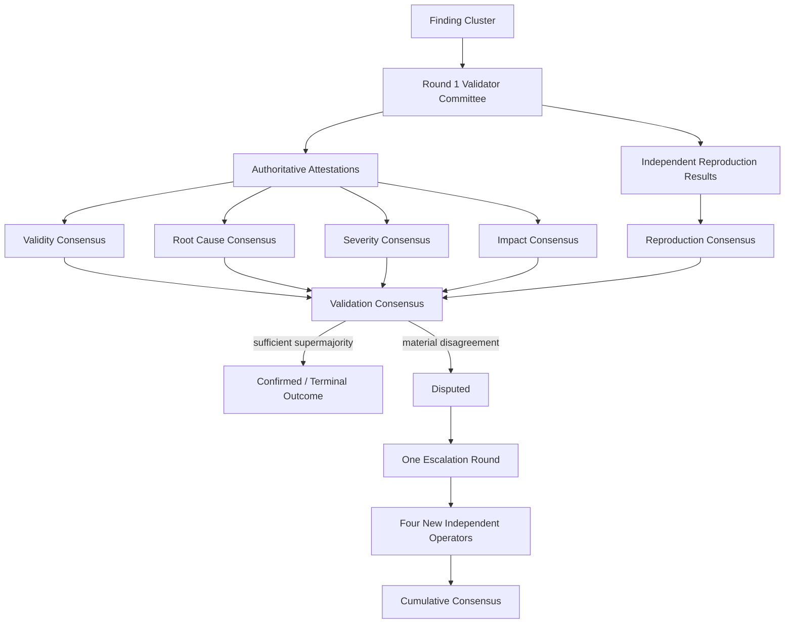

# ProofGuard Validator Consensus v1

Status: Week 8 Day 4 implemented.

## Trust model and boundary

Agents propose security claims. Protocol-selected validators independently
produce reproduction evidence and structured attestations. No validator is
ground truth, and a 51% vote is deliberately insufficient. The backend verifies
relationships and applies deterministic rules; it does not invent evidence or a
verdict outside those rules. Shadow validators never influence authoritative
truth.

Day 4 consumes immutable Day 1 attestations and Day 3 reproduction records. It
executes no PoC and does not alter the Week 3 sandbox. It creates no validator
score, reputation update, minority penalty, reward, staking/slashing action,
payment, wallet, key, blockchain transaction, or Week 7 reward rewrite.



## Versioned quorum and supermajority

`ValidatorConsensusPolicyV1` uses integer arithmetic over the authoritative
target `N`, never the smaller number of responses:

```text
Quorum(N) = N - 1
Supermajority(N) = ceil(2N/3) = (2N + 2) // 3
```

| N | Context | Quorum | Supermajority |
|---:|---|---:|---:|
| 5 | STANDARD Round 1 | 4 | 4 |
| 7 | HIGH_ASSURANCE Round 1 | 6 | 5 |
| 9 | STANDARD cumulative | 8 | 6 |
| 11 | HIGH_ASSURANCE cumulative | 10 | 8 |

Thus 3 accepted versus 2 rejected is `DISPUTED`, not accepted. A missing
validator is neither an accept nor a reject, and insufficient participation is
`NO_QUORUM`, not rejection. Reputation, agent `CategoryScore`, membership,
expert status, validator history, and rewards do not weight votes: one distinct
authoritative operator contributes at most one attestation per round.

## Structured component consensus

Validity, reproduction, root cause, normalized severity, and impact are
aggregated separately. Each `ConsensusComponentResult` records target size,
valid response count, quorum and threshold, canonical value counts, supporting
operator/evidence IDs, dissenting attestations, and any unresolved reason.

For a reproducible finding, `CONFIRMED` requires every condition:

- validity `accepted` reaches supermajority;
- root cause `confirmed` reaches supermajority;
- authoritative Day 3 status `reproduced` reaches supermajority;
- impact `validated` reaches supermajority; and
- one exact normalized severity label reaches supermajority.

Severity labels are never averaged, assigned numeric weights, reduced to a
median, or inferred from reporter severity/reward values. Material disagreement
in any required accepted component yields `DISPUTED` with one or more canonical
reason codes. A failed, unsafe, unsupported, timed-out, or infrastructure-error
reproduction remains explicit evidence and never directly means rejection.

If validity itself reaches supermajority for `rejected`, `out_of_scope`,
`insufficient_evidence`, `unsafe_poc`, or `unsupported`, the corresponding
non-accepted terminal outcome does not require accepted-only root cause,
severity, reproduction, or impact consensus. Protocol corruption—wrong links,
changed fingerprints, duplicate operators, duplicate evidence, or impossible
component winners—is an error rather than a validator dispute.

## Authoritative evidence and fingerprints

The evidence set is derived from finalized committee seats. Shadow assignments,
reproductions, and attestations are retained by Days 1–3 but excluded from every
Day 4 denominator, count, and fingerprint. Current NodeRegistry operator
mapping and cumulative operator uniqueness are revalidated.

The source fingerprint commits to the policy, project/routing/cluster source,
ordered rounds and committees, committee targets, authoritative assignment/node/
operator/role identities and fingerprints, finalized attestation values and
fingerprints, Day 3 record statuses and fingerprints, thresholds, and the
reproduction requirement. The calculation fingerprint additionally commits to
all component summaries, final outcome, final severity, and dispute reasons.
Timestamps, host paths, reputation, category scores, membership, rewards, and
shadow-only changes are excluded.

Calculation persists a `calculated` snapshot. Finalization reloads the exact
included rounds and recalculates without mutating them; changed authoritative
evidence blocks stale finalization. Finalized records are immutable and repeat
finalization recovers the same idempotent dispute/cluster references. The
read-only verification endpoint independently checks source, calculation,
threshold, outcome, diversity, and shadow exclusion.

## Validation rounds, disputes, and escalation

Round 1 is `initial` and references the existing Day 2 committee. A finalized
`DISPUTED` or `NO_QUORUM` Round 1 creates one deterministic
`ValidationDispute`. Escalation is explicit. `ValidationEscalationPolicyV1`
adds exactly four authoritative seats, permits at most one escalation round,
and configures no new shadow seat.

The escalation service reuses `ValidatorCommitteeService`; it does not contain
a second selector. Its protocol-owned exclusion list contains every prior
authoritative and shadow operator, while the existing selector independently
excludes cluster reporters and currently ineligible/capacity-full nodes. The
public API cannot submit validator IDs. If four new independent operators are
unavailable, escalation becomes `blocked_insufficient_validators`; it never
reuses an old operator, duplicates an operator, or creates a partial committee.

Round 2 uses the unchanged Day 3 reproduction and Day 1 attestation paths.
Cumulative consensus includes all legitimate evidence from Rounds 1 and 2;
callers cannot omit dissenting evidence. STANDARD becomes `N=9`, and
HIGH_ASSURANCE becomes `N=11`. If the cumulative result is still disputed or
has no quorum, the original dispute becomes `unresolved`. No Round 3 is allowed,
preventing result shopping.

## FindingCluster and legacy compatibility

Terminal new Week 8 consensus attaches an immutable consensus reference,
outcome, and optional consensus severity to the cluster under
`validation_authority=validator_consensus`. The legacy Week 4 accepted status,
severity, and cluster source fingerprint remain intact for backward-compatible
readers; validator-consensus-aware consumers explicitly use the new fields.
Disputed/no-quorum snapshots do not mark a cluster finally validator-confirmed.
Historical clusters are not fabricated into decentralized consensus, and
finalized Week 7 accounting is never modified.

## Minority preservation and limitations

A dissenting validator may have noticed environment drift, a root-cause
mismatch, unsupported impact, or severity exaggeration. Consensus therefore
does not label, penalize, score, demote, or withhold rewards from a minority
validator. Day 5 may later evaluate performance against resolved truth under a
separate policy.

V1 aggregates exact enums rather than performing semantic analysis. It assumes
NodeRegistry operator identities represent independence; several colluding
registered operators remain a known limitation. Only one bounded escalation is
implemented. Validator performance scoring and economic settlement remain
future work.
