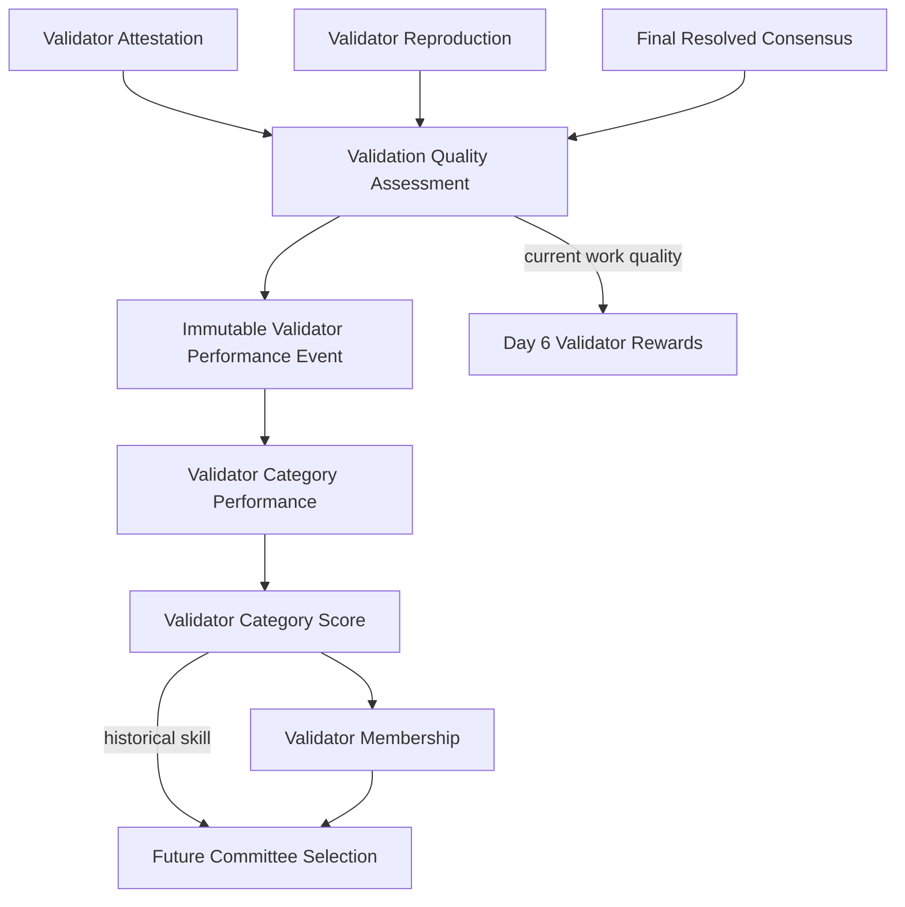

# ProofGuard Validator Performance v1

Status: Week 8 Day 5 implemented.

## Architecture and trust boundary

Day 5 evaluates structured validator work only after a stable, finalized
validator-consensus resolution exists. `CONFIRMED`, `REJECTED`,
`OUT_OF_SCOPE`, `INSUFFICIENT_EVIDENCE`, `UNSAFE`, and `UNSUPPORTED` are
evaluable. `DISPUTED`, `NO_QUORUM`, pending escalation, and unresolved or
blocked disputes are not truth and create no correctness assessment or
performance event.

Agent discovery skill and validator verification skill are distinct domains.
The existing agent/miner `CategoryPerformance`, `CategoryScore`, subnet
`Membership`, `ContributionScore`, and global `NodeRecord.reputation_score`
are neither read as validator skill nor mutated by this pipeline. A hybrid node
may therefore hold an agent access-control score of 0.95 and a validator
access-control score of 0.55 without conflict.



Day 5 executes no PoC, changes no sandbox or consensus rule, spends no
`validator_pool`, emits no reward, updates no generic reputation, and rewrites
no Week 7 accounting.

## Final resolution and the minority principle

An assessment references the cluster's current `final_validation_consensus_id`,
and the read-only Day 4 verifier must validate that consensus before scoring.
For escalation, all attested work from every included round is evaluated
against the final cumulative resolution—not against the validator's local
round result.

For example:

```text
Round 1: 3 ACCEPT, 2 REJECT -> DISPUTED
Escalation cumulative result: REJECTED
```

The two original reject validators receive correct validity assessments. The
original local majority does not. ProofGuard measures accuracy against final
resolution, not conformity with a crowd. Dissent alone is neither a protocol
violation nor grounds for suspension.

## ValidationQualityAssessment

`ValidationQualityAssessment` answers: “How good was this specific validation?”
It binds the final consensus, round, committee, assignment, node/operator,
authoritative or shadow role, finalized attestation, validator reproduction,
category, component scores, applicable set, policy, and source fingerprint.
It is calculated then revalidated and finalized; a finalized assessment is
immutable and idempotent per assignment, final-consensus version, and policy.
Validators cannot submit their own scores.

`ValidationQualityPolicyV1` uses strict `Decimal` arithmetic and these exact
base weights:

| Component | Weight |
|---|---:|
| Validity accuracy | 0.35 |
| Reproduction accuracy | 0.20 |
| Root-cause accuracy | 0.15 |
| Exact severity accuracy | 0.15 |
| Impact accuracy | 0.10 |
| Protocol compliance | 0.05 |

For applicable component set `A`:

```text
ValidationQualityScore = Σ(w_i × s_i) / Σ(w_i), for i in A
```

The result is quantized to six decimal places and constrained to `[0, 1]`.
Weights must sum exactly to `1.00`; invalid configuration is rejected rather
than silently normalized. Non-applicable components are excluded and remaining
weights are renormalized. Thus a correctly rejected finding with only validity,
reproduction, and compliance applicable can score 1.0, not 0.60.

### Component rules

- Validity is an exact mapping from final outcome to the attestation validity
  enum (`CONFIRMED` expects `ACCEPTED`, and terminal non-accepted outcomes expect
  their matching value).
- Reproduction compares the validator's independently attributable Day 3
  terminal status to a resolved reproduction component. If no final
  reproduction truth exists, it is not applicable.
- Root cause, severity, and impact apply to `CONFIRMED` findings. Root cause
  expects `CONFIRMED`, severity requires the exact normalized consensus label,
  and impact expects `VALIDATED`. Severity receives no distance-based partial
  credit.
- Protocol compliance is objective structural compliance: current assignment
  and operator attribution, authorized role, matching attestation/reproduction,
  server-derived reproduction state, and valid immutable fingerprints. Invalid
  or forged provenance fails closed instead of being scored as ordinary
  technical disagreement.

An assigned PoC classified `UNSAFE` by SafetyPreflight does not make the
validator unsafe. Correctly retaining that status is compliant protocol
behavior. A narrow internal `ValidatorProtocolViolationEvent` records only an
explicitly adjudicated conflict breach, forged reproduction link, unauthorized
duplicate attestation, or safety-bypass attempt. It has no public write API and
ordinary request rejection never creates one automatically. Valid finalized
work with no such event scores compliance 1; an attributable event scores 0 and
can suspend future validator membership. Corrupt provenance still fails closed
instead of becoming an ordinary quality opinion.

## Immutable events and rebuildable category performance

Each finalized assessment creates at most one deterministic, immutable
`ValidatorPerformanceEvent`. It records validator/operator, project/routing/
cluster/category, role, assessment and final-consensus identities, applicable
correctness booleans, protocol compliance, current quality, finalization time,
and a canonical fingerprint. Reapplication returns the same event and cannot
double-count.

`ValidatorCategoryPerformance` is rebuilt from the sorted event stream for one
`validator_node_id + category`. It tracks resolved, authoritative, and shadow
counts; evaluated/correct counters for all structured components; compliance;
completed assignments; and quality sum/average. The source fingerprint commits
to ordered event IDs/fingerprints and the score policy version, but excludes
timestamps, rewards, ranks, membership, and generic reputation. Rebuild changes
only derived aggregate state and is deterministic.

Shadow attestations never retroactively influence consensus. Once final truth
exists, however, their assessments and events are legitimate historical skill
evidence. This creates the cold-start path from shadow work toward future
validator eligibility.

## ValidatorCategoryScore and neutral shrinkage

`ValidatorCategoryScore` answers: “How good has this validator historically
been in this category?” It is not the quality of the current task and must not
be used as a Day 6 payout multiplier.

`ValidatorCategoryScorePolicyV1` calculates:

```text
raw_score =
    0.30 × validity_accuracy
  + 0.20 × reproduction_accuracy
  + 0.15 × root_cause_accuracy
  + 0.15 × severity_accuracy
  + 0.10 × impact_accuracy
  + 0.05 × protocol_compliance
  + 0.05 × assignment_reliability
```

Missing component history uses the neutral prior `0.500000`; it is never
treated as zero and no denominator can divide by zero. V1 assignment
reliability is completed resolved work divided by resolved work represented in
the event stream. Cancelled, invalidated-conflict, and external-system-failure
assignments are not performance events and therefore do not become no-shows.

```text
experience_confidence = min(resolved_validations / 10, 1)
final_score = 0.50 + experience_confidence × (raw_score - 0.50)
```

At raw 0.90, one resolved task yields 0.54, five yield 0.70, and ten or more
yield 0.90. The same shrinkage protects a new validator from one unlucky task.
All inputs and results are six-decimal `Decimal` values in `[0, 1]`. Scores are
isolated by category and node; nodes of one operator are not silently merged.

## Validator membership

`ValidatorMembership` is independent of agent subnet membership and is derived
server-side from validator category score, resolved history, structured
component samples, compliance, NodeRegistry validator/hybrid capability, node
status, and category support.

V1 uses:

- `CANDIDATE`: fewer than three resolved validations or insufficient score;
- `PROBATION`: at least 3 resolved and score at least 0.40;
- `ACTIVE`: at least 5 resolved, score at least 0.60, at least 3 validity
  samples, and no attributable compliance violations;
- `EXPERT`: at least 10 resolved, score at least 0.80, validity accuracy at
  least 0.80, reproduction accuracy at least 0.75 when at least three samples
  exist, and no attributable compliance violations;
- `SUSPENDED`: current validator node is inactive, suspended, or banned;
- `REMOVED`: validator/hybrid capability or category support is unavailable.

Hysteresis retains `ACTIVE` at 0.50 and `EXPERT` at 0.70 when their remaining
requirements hold. Incorrect technical judgment or dissent never directly
suspends a validator. Membership changes only future eligibility and never
rewrites historical consensus.

## Persistence, APIs, and Day 6 boundary

Artifacts use the existing validator-protocol root, safe identifiers, UTF-8
canonical JSON, SHA-256 fingerprints, atomic create/write operations, UTC
timestamps, and deterministic ordering. No database migration or parallel
storage framework is introduced.

The API exposes an empty-body, server-derived consensus evaluation action;
assessment reads; validator/category performance, score, and membership reads;
and an empty-body deterministic rebuild action. Extra fields are forbidden, so
callers cannot supply accuracy, quality, score, membership, reward, or truth.

Future committee selection may use historical `ValidatorCategoryScore` and
`ValidatorMembership` as opportunity inputs. Day 6 may use the current
`ValidationQualityAssessment` when allocating the current task's validator
pool. Historical skill is deliberately not a direct reward multiplier. Day 5
does not calculate or pay any validator reward.
