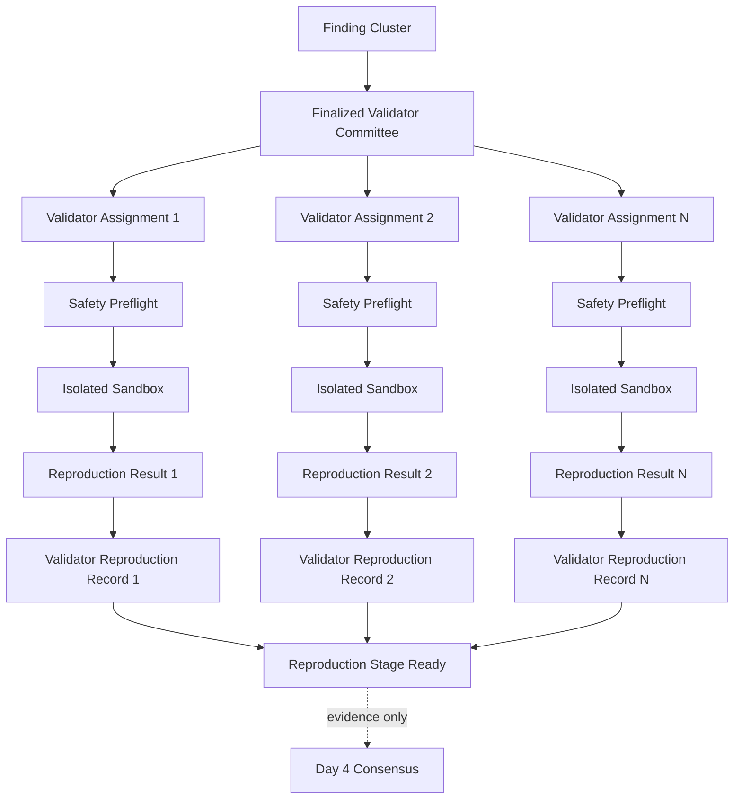

# ProofGuard Independent Validator Reproduction v1

Status: Week 8 Day 3 implemented.

## Trust model and boundary

An agent is an untrusted proposer. A submitted PoC is untrusted code. A
protocol-assigned validator is an independent evaluator, but is not ground
truth. A `ValidatorReproductionRecord` is attributable technical evidence.
Neither one record nor a count of matching records determines truth on Day 3.
Future Day 4 logic may combine this evidence with structured
`ValidationAttestation` records.

Day 3 does not implement a majority, quorum, validity/severity/root-cause
consensus, reward, reputation update, validator score, staking, slashing,
payment, private-key handling, or autonomous PoC generation.

## Why every authoritative validator reproduces in v1

STANDARD has five authoritative seats and therefore up to five independent
attempts. HIGH_ASSURANCE has seven and therefore up to seven. Validators may
use the same approved PoC, source revision, and environment policy, but each
assignment receives a distinct logical request, Week 3 `ReproductionResult`,
storage reference, and validator reproduction record. A validator cannot adopt
another validator's result or the reporter's legacy result as its own.

HIGH_ASSURANCE adds independent operators; it never adds sandbox privileges.
Safety and resource policy are identical in both modes.

## Submitted PoC reproduction

`SUBMITTED_POC` is the default. Selection first resolves the canonical cluster
member's stored Week 3 artifact. If that member has no approved executable
artifact, eligible cluster members are examined in deterministic submission
order. Reward, reputation, membership, and caller ordering are not inputs. If
no approved PoC/test identity exists, the attempt is terminal `unsupported`;
the caller cannot supply an arbitrary host path to replace it.

The same artifact fingerprint may appear in several validator records. Result,
request, assignment, node, and operator identities remain distinct.

## Independent reproduction

`INDEPENDENT_REPRODUCTION` has distinct protocol provenance. V1 accepts only a
trusted/internal reference to an artifact already ingested beneath `repo/test`
through the existing safe path rules. The public API deliberately does not
offer a general code-upload or absolute-path interface. Autonomous generation
is out of scope. Once resolved, independent artifacts use exactly the same
SafetyPreflight and sandbox path as submitted PoCs.

## PoCs are untrusted: Week 3 reuse

`execute_reproduction_safely` is the shared Week 3 execution primitive used by
both legacy finding reproduction and validator execution. It:

- copies the repository to an isolated temporary workspace and always cleans it;
- invokes the existing `run_safety_preflight` before execution;
- rejects traversal, escaping/missing artifacts, repository symlinks, unsafe
  Foundry configuration, FFI, secret/filesystem access, and RPC or network-fork
  requests;
- invokes the existing Docker runner only after preflight passes;
- keeps networking disabled, uses UID/GID 1000, never uses privileged mode or
  the Docker socket, drops all Linux capabilities, and enables
  `no-new-privileges`;
- preserves CPU, memory, PID and timeout limits, caps captured output, and uses
  a bounded process-wide sandbox concurrency limit.

Validator status, reputation, committee assurance, shadow role, or protocol
administration never bypasses these checks.

## Source snapshot and environment fingerprints

The source revision comes from the trusted parsed scope `commit_hash`; when it
is absent, the finalized routing scope fingerprint is used. Unsafe revision
text is represented by a deterministic digest rather than persisted verbatim.
The source snapshot commits to project/routing identity, finalized routing
scope, revision, sorted in-scope paths, and the SHA-256 of each available
in-scope file. PoC files are fingerprinted separately.

The environment fingerprint commits to the Day 3 execution version, Week 3
sandbox policy, configured sandbox image reference, forge toolchain identity,
network/user/capability settings, CPU/memory/PID/timeout/output limits. It omits
hostnames, usernames, temporary paths, container IDs, and timestamps. The v1
image reference is `foundry-sandbox:latest`; pinning an immutable image digest
and compiler build is known future hardening.

## Validator reproduction lifecycle and persistence

One deterministic `ValidatorReproductionJob` is exclusively created per
assignment and execution protocol version:

`running -> finalized`

Its finalized result maps Week 3 states without interpreting finding truth:

- `reproduced`: the allowlisted sandbox command exited successfully;
- `failed`: it executed but exited non-zero;
- `rejected_unsafe`: SafetyPreflight blocked execution;
- `unsupported`: no supported approved artifact/test environment was available;
- `timeout`: the sandbox exceeded its limit;
- `sandbox_error` or `error`: infrastructure failed, distinct from claim failure.

The immutable `ValidatorReproductionRecord` stores committee, assignment, node,
authoritative operator, role, mode, artifact/source/environment fingerprints,
logical Week 3 request identity, attributed result identity/storage reference,
terminal status, and a canonical source fingerprint. Large stdout/stderr remain
in the attributed Week 3 result namespace rather than being copied into the
protocol envelope.

All identifiers and storage references are safe and relative. JSON creation is
exclusive or atomic. A duplicate completed request returns the existing record;
a simultaneous duplicate observes the existing running job and cannot launch a
second sandbox. Finalized records are frozen. V1 does not automatically retry
semantic outcomes or timeouts and therefore cannot shop repeatedly for a
preferred result. A process crash can leave a running job requiring trusted
operator recovery; automated retry lineage is deferred.

## Authorization and stale-state checks

Before a job is claimed, the service reloads the full
project/routing/cluster/committee/assignment/node chain. It requires a finalized
committee, exact seat mapping, active validator/hybrid node, unchanged operator,
unexpired/non-cancelled assignment, supported category, and no current reporting
operator conflict. Assignment or cluster changes therefore block new execution.
Completed historical evidence is retained. Attestation linkage revalidates the
attributed Week 3 result, artifact, record fingerprint, and audited source
snapshot; it cannot claim another assignment or rewrite a terminal status.

## Authoritative versus shadow reproduction

Both roles may execute the same pipeline and retain role provenance. Shadow
evidence is non-authoritative. It does not replace an authoritative attempt and
does not enter the readiness denominator.

## Committee reproduction readiness

Readiness is a deterministic completion projection, not a verdict. It reports
authoritative/shadow targets and terminal counts, pending assignment IDs, and
status counts. `ready` means every authoritative seat has exactly one terminal
record. For example, three `reproduced`, one `failed`, and one `timeout` is
ready. An unfinished shadow seat does not block readiness. No accepted/rejected
or majority field exists.

## Scale tradeoff and future execution

One hundred STANDARD clusters may produce roughly 500 authoritative attempts;
HIGH_ASSURANCE produces more. V1 prioritizes evidence independence and audit
clarity over compute efficiency. Future versions may add assurance-aware
caching, verifiable execution, specialized infrastructure, or signed remote
validator results. Remote self-asserted results are not authoritative today.
Protocol records are separated from the local execution implementation so that
future validator nodes can execute their own sandbox without changing historic
record attribution.
