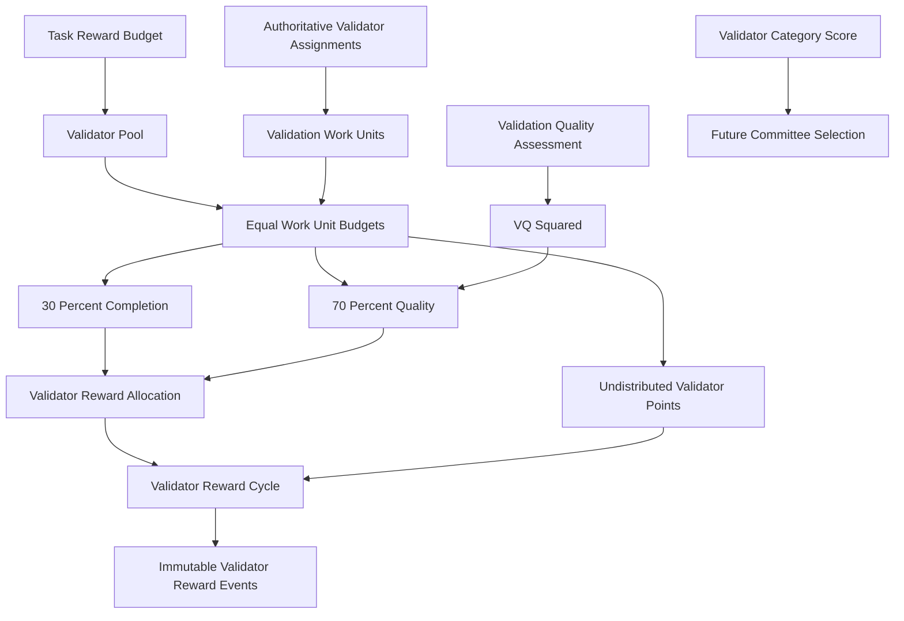

# Validator Reward Allocation v1

Week 8 Day 6 activates the client task's `validator_pool` as an independent,
single-consumption reward stream. Rewards are simulated protocol points. This
specification adds no token, wallet, payment, staking, or slashing behavior.

## Trust and economic model

Historical `ValidatorCategoryScore` and `ValidatorMembership` influence future
committee opportunity. They never multiply the payout for current work. A
current payout depends only on a legitimate authoritative assignment, objective
completion, and—where stable truth exists—the finalized Day 5
`ValidationQualityAssessment` for that assignment.

This separation prevents reputation compounding and herd incentives. Severity,
assurance mode, escalation round, reproduction mode, response speed, local
majority agreement, membership, global reputation, agent `CategoryScore`, and
historical reward totals are not reward inputs.

## Pool-specific reward streams

One `TaskRewardBudget` contains independent `MINER`, `VALIDATOR`, and future
`PROTOCOL` streams. `RewardPoolConsumption` is unique by budget and pool kind.
Consequently, a finalized Week 7 miner cycle and one finalized validator cycle
may coexist, while a second finalization of the same validator pool fails
closed. No historical miner cycle or `RewardEvent` is rewritten, and migration
does not fabricate retroactive validator rewards.

## Validation work units

One legitimate authoritative `ValidatorAssignment` in a finalized committee and
validation round is one equal-weight work unit. Shadow assignments are retained
as Day 5 skill evidence but are not client-funded work units in v1. A cancelled
assignment is excluded; an expired or incomplete legitimate seat remains a work
unit and reserves its share with a zero payout. Duplicate operator seats or
stale assignment, node, committee, round, attestation, reproduction, consensus,
or assessment attribution are protocol errors rather than economic outcomes.

Round 1 and bounded escalation assignments are all included. Escalation creates
more equal work units but never increases `validator_pool`, so it reduces each
unit's base budget rather than creating new points. The same operator may be
paid for separate assignments on separate clusters; there is no task-wide
operator deduplication.

## Economic closure

Calculation requires a stable work set. Every discovered committee must be
finalized and included in the cluster's latest finalized consensus. Every
included round must be finalized. A resolved consensus is closed. An unresolved
`DISPUTED` or `NO_QUORUM` consensus is closed only when its dispute is
`RESOLVED`, `UNRESOLVED`, or `BLOCKED_INSUFFICIENT_VALIDATORS`; open, planned,
or running escalation blocks calculation. A routing with no validator
committees is a valid zero-work snapshot: the entire validator pool remains
undistributed.

## Reward policy and formulas

`ValidatorRewardPolicyV1` uses exact `Decimal` values:

```text
completion_share = 0.300000
quality_share    = 0.700000
quality_exponent = 2
work_unit_weight = 1.000000
quantum          = 0.000001
```

The shares must sum exactly to one; invalid policy is rejected rather than
normalized.

Let `P` be `validator_pool` and `W` the authoritative work-unit set. The existing
deterministic largest-remainder allocator divides `P` equally across `W`:

```text
sum(BaseBudget_i) = P
```

The same allocator splits every base budget exactly:

```text
CompletionBudget_i + QualityBudget_i = BaseBudget_i
CompletionBudget_i = 30% of BaseBudget_i
QualityBudget_i    = 70% of BaseBudget_i
```

A finalized attestation and terminal, correctly linked reproduction record
constitute completion unless an adjudicated validator-attributable protocol
violation exists. Technical disagreement, timeout, failed reproduction,
unsupported execution, or correctly recording an unsafe assigned artifact do
not by themselves negate completion.

```text
CompletionReward_i = CompletionBudget_i  if completed
                   = 0                   otherwise

QualityFactor_i = VQ_i²
QualityReward_i = floor_to_quantum(QualityBudget_i * VQ_i²)

ValidatorReward_i = CompletionReward_i + QualityReward_i
```

There is no minimum VQ threshold. Unused quality budget and incomplete-seat
budget remain undistributed and are never transferred to peers.

For resolved consensus, every completed authoritative assignment must have one
finalized Day 5 assessment for that exact final cumulative consensus. A missing
assessment is an integration error and blocks processing; it is not silently
treated as VQ zero. A terminal unresolved validation has no fabricated truth
score: completed work can receive the completion component, while its quality
component remains undistributed.

## Anti-herding economics

Validators are not paid for matching their local majority. Day 6 consumes only
the current Day 5 VQ, which is measured against stable final truth. For example,
a Round 1 minority `REJECT` opinion can receive full quality reward when the
cumulative escalation outcome is `REJECTED`; an original majority opinion can
receive less when final truth contradicts it.

Severity is also not a multiplier. High assurance can create seven work units
instead of five, which represents additional assigned work without paying a
validator more for choosing `Critical`.

## Accounting and rounding

All economic arithmetic is `Decimal`. Equal unit allocation and the 30/70 split
use deterministic largest remainder. VQ scaling rounds down to six decimals and
is not redistributed.

For every work unit:

```text
CompletionReward_i <= CompletionBudget_i
QualityReward_i    <= QualityBudget_i
ValidatorReward_i  <= BaseBudget_i
ValidatorReward_i + Undistributed_i = BaseBudget_i
```

At task level:

```text
sum(BaseBudget_i) = validator_pool
sum(ValidatorReward_i) + sum(Undistributed_i) = validator_pool
```

Thus distributed validator points can never exceed the client-funded validator
pool. The miner and protocol pools are neither read as payout capacity nor
consumed by this stream.

## Lifecycle, fingerprints, events, and recovery

The validator cycle reuses the Week 7 lifecycle: `DRAFT -> CALCULATED ->
FINALIZED`. Draft emits no events. Calculated stores all allocations and source
and calculation fingerprints. Finalization reloads the full source snapshot,
requires identical fingerprints, verifies conservation, publishes deterministic
positive-only `ValidatorRewardEvent` records with exclusive atomic creation,
claims the `VALIDATOR` pool once, and finally writes the cycle status.

The source fingerprint commits to policy, routing and budget fingerprints,
exact validator pool, closure state, ordered authoritative assignments,
assignment/committee/round/operator identities and fingerprints, attestation
and reproduction identities and fingerprints, completion eligibility, final
consensus, Day 5 assessment and VQ, and equal base and 30/70 budgets. The
calculation fingerprint additionally commits to VQ², component rewards, total
reward, per-unit undistributed amount, and task totals.

It excludes historical validator score, validator membership, reputation,
agent skill, miner reward amounts, leaderboard state, host paths, and generated
timestamps. Changes to those excluded values cannot stale or alter payout.

One positive allocation produces one immutable event keyed deterministically by
cycle, assignment, and validator-reward event type. Zero allocations remain
auditable allocations but emit no economic event. Exclusive event creation,
deterministic IDs, idempotent pool consumption, and status-last finalization
allow safe retry after partial publication or a lost response. Read-only
verification checks source freshness, allocation conservation, closure, event
completeness, and pool-consumption consistency without mutation.

## API boundary

The API creates, calculates, finalizes, reads, lists, and verifies validator
reward cycles and exposes allocations and events. Request bodies cannot submit
validator identities, work-unit budgets, VQ, VQ², completion or quality rewards,
final rewards, pool-consumption state, severity, reputation, historical score,
membership, wallet data, or token data.

## Architecture



The `ValidatorCategoryScore -> Future Committee Selection` path is deliberately
separate from current reward allocation.

## Day 6 limitations

Day 6 does not price measured compute differences, pay shadow assignments,
spend the protocol pool, reopen historical rewards, settle money, issue tokens,
manage wallets, stake, slash, score validator performance, or modify consensus.
Future correction of immutable economic history requires an explicit
compensation protocol; it is not implemented by overwriting events.
